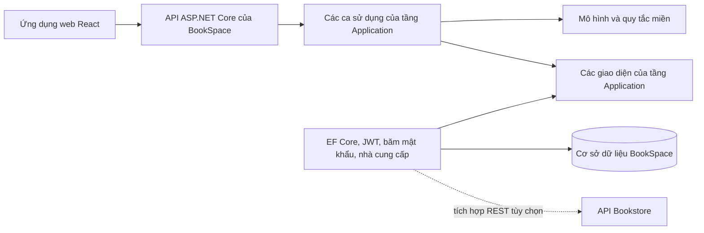

# BookSpace

BookSpace là nền tảng đọc sách cộng đồng độc lập, được xây dựng bằng ASP.NET Core
và React. Sản phẩm giúp độc giả khám phá sách, quản lý thư viện cá nhân, ghi nhận
tiến độ đọc, đặt mục tiêu đọc có thể đo lường, lưu ghi chú đọc sách riêng tư,
đăng bài đánh giá, tham gia câu lạc bộ và hoàn thành các thử thách đọc sách.

BookSpace không cần Bookstore để hoạt động. Một bộ điều hợp nhà cung cấp được
tắt mặc định có thể kết nối hai sản phẩm trong tương lai mà không dùng chung
cơ sở dữ liệu.

## Khả năng của sản phẩm

- Đăng ký tài khoản, đăng nhập, làm mới mã truy cập (token) và quản lý hồ sơ
- Tìm kiếm sách, tác giả, thể loại và nhận đề xuất cá nhân hóa dựa trên quy tắc
- Quản lý các kệ cá nhân: muốn đọc, đang đọc và đã đọc
- Ghi nhận tiến độ theo trang, hẹn giờ đọc tập trung do máy chủ quản lý và hiệu chỉnh lịch sử phiên đọc
- Đặt mục tiêu đọc cá nhân với tiến độ được tính từ hoạt động đọc thực tế
- Lưu ghi chú riêng tư, trích dẫn, số trang và thẻ có thể tìm kiếm
- Chấm điểm, đăng bài đánh giá, bình luận và bày tỏ cảm xúc
- Khám phá độc giả công khai, nhận gợi ý dựa trên mối quan hệ, xem hồ sơ đọc theo quyền riêng tư, theo dõi người dùng và sử dụng bảng tin xã hội hỗ trợ lọc, phân trang
- Tham gia câu lạc bộ sách với lời mời riêng tư, vai trò thành viên, sách đang đọc chung, thảo luận và các đợt đọc chung
- Trò chuyện theo thời gian thực trong câu lạc bộ, với lịch sử chỉ dành cho thành viên, trạng thái chưa đọc và thông báo trong ứng dụng
- Tham gia thử thách đọc sách với tiến độ do máy chủ tính từ các sách đã hoàn thành trong thư viện
- Trung tâm thông báo trong ứng dụng với số mục chưa đọc do máy chủ quản lý, bộ lọc theo nhóm, phân trang và tùy chọn nhận thông báo
- Bảng điều khiển thành viên, bản đồ nhiệt hoạt động theo thời gian, chuỗi ngày đọc, báo cáo theo kỳ và dự báo thời điểm đọc xong
- Quản trị danh mục và thử thách
- Tùy chọn tích hợp nhà cung cấp sách bên ngoài

## Kiến trúc



Các phụ thuộc đều hướng vào bên trong:

```text
BookSpace.Api -> BookSpace.Application -> BookSpace.Domain
BookSpace.Infrastructure -> BookSpace.Application + BookSpace.Domain
```

Ứng dụng React tuân theo ranh giới tương tự:

```text
src/pages -> src/hooks -> src/services -> src/lib/api.ts
```

## Cấu trúc kho mã nguồn

```text
bookspace/
├── backend/
│   ├── src/
│   │   ├── BookSpace.Domain/
│   │   ├── BookSpace.Application/
│   │   ├── BookSpace.Infrastructure/
│   │   └── BookSpace.Api/
│   └── tests/
├── frontend/
├── docs/
├── scripts/
└── docker-compose.yml
```

Các đặc tả chi tiết về sản phẩm và kỹ thuật nằm trong thư mục [`docs`](./docs).

## Yêu cầu hệ thống

- .NET SDK 10
- Node.js 22 trở lên
- npm 10 trở lên
- Docker Desktop (không bắt buộc)

SQLite là cơ sở dữ liệu mặc định cho môi trường phát triển, vì vậy khi chạy
cục bộ không cần cài thêm máy chủ cơ sở dữ liệu riêng.

## Chạy cục bộ

### Phía máy chủ

```powershell
cd T:\bookspace\backend
dotnet restore BookSpace.slnx
dotnet run --project src\BookSpace.Api
```

API chạy tại `http://localhost:5080`.

- Tài liệu OpenAPI: `http://localhost:5080/openapi/v1.json`
- Kiểm tra trạng thái: `http://localhost:5080/health`

### Ghi chú về Windows Application Control

Trên máy này, Windows Application Control chặn các tệp thực thi .NET được khởi
chạy từ `T:\bookspace` với mã lỗi `0x800711C7`. Đây là chính sách của máy, không
phải lỗi ứng dụng. Hãy giữ mã nguồn tại `T:\bookspace`, nhưng chạy phía máy chủ từ
một vị trí tin cậy đã được phê duyệt hoặc nhờ quản trị viên cho phép các tệp kết
quả dựng BookSpace trên ổ `T:`.

### Giao diện web

Mở một cửa sổ PowerShell khác:

```powershell
cd T:\bookspace\frontend
Copy-Item .env.example .env
npm install
npm run dev
```

Mở `http://localhost:5173`.

### Khởi chạy cả phía máy chủ và giao diện web

Sau khi đã khôi phục các gói phụ thuộc ít nhất một lần:

```powershell
cd T:\bookspace
.\scripts\run-local.ps1
```

Khi thoát, tập lệnh sẽ dừng cả hai tiến trình con.

## Tài khoản phát triển

Dữ liệu mẫu được khởi tạo trong môi trường phát triển gồm:

| Vai trò | Email | Mật khẩu |
|---|---|---|
| Quản trị viên | `admin@bookspace.local` | `Admin123!` |
| Độc giả | `reader@bookspace.local` | `Reader123!` |

Các tài khoản này chỉ dành cho môi trường `Development`.
Quá trình khởi tạo cũng tạo hồ sơ minh họa không thể đăng nhập `Hà Linh`. Quan
hệ theo dõi và hoạt động đọc công khai của hồ sơ này cung cấp dữ liệu thực tế
cho tính năng gợi ý độc giả. Độc giả và quản trị viên được tạo sẵn cũng hỗ trợ
các kịch bản kiểm tra nhanh cho đề xuất sách cá nhân hóa và đề xuất khởi đầu
lạnh mà không cần học máy.

## Chạy bằng Docker

```powershell
cd T:\bookspace
docker compose up --build
```

Sau đó mở:

- Giao diện web: `http://localhost:5173`
- API: `http://localhost:5080`

Dữ liệu BookSpace được lưu bền vững trong volume Docker có tên `bookspace-data`.

## Kiểm tra

Chạy toàn bộ quy trình kiểm tra:

```powershell
cd T:\bookspace
.\scripts\verify.ps1
```

Hoặc kiểm tra riêng từng phần:

```powershell
cd T:\bookspace\backend
dotnet build BookSpace.slnx
dotnet test BookSpace.slnx

cd T:\bookspace\frontend
npm run lint
npm test
npm run build
```

Khi API đang chạy, kiểm tra luồng của độc giả được tạo sẵn:

```powershell
cd T:\bookspace
.\scripts\smoke-api.ps1
```

## Tích hợp Bookstore tùy chọn

Tích hợp Bookstore mặc định được tắt:

```text
BOOKSPACE_BookstoreIntegration__Enabled=false
```

Khi được bật, BookSpace có thể truy vấn Bookstore để tìm sách, lấy thông tin
giá, trạng thái khả dụng và tạo liên kết mua hàng. Việc liên kết tài khoản và
nhập sách đã mua mới chỉ là hướng tích hợp trong tương lai. Danh mục cốt lõi,
thư viện, cộng đồng, câu lạc bộ, thử thách và xác thực vẫn hoàn toàn thuộc quyền
quản lý của BookSpace.

Các quy tắc tích hợp được mô tả trong
[`docs/INTEGRATION_WITH_BOOKSTORE.md`](./docs/INTEGRATION_WITH_BOOKSTORE.md).
