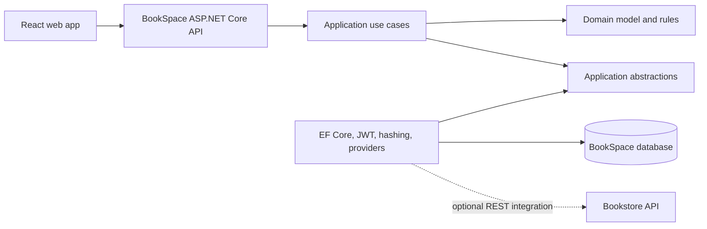

# BookSpace

BookSpace is an independent social reading platform built with ASP.NET Core and
React. It helps readers discover books, maintain a personal library, record
reading progress, set measurable reading goals, keep private reading notes,
publish reviews, join clubs and complete reading challenges.

BookSpace does not require Bookstore to run. A disabled-by-default provider
adapter can connect the two products later without sharing databases.

## Product capabilities

- Account registration, login, token refresh and profile management
- Searchable book, author and category catalog with rule-based personalized recommendations
- Personal shelves: want to read, reading and read
- Page progress, server-backed focus timer and correctable reading-session history
- Personal reading goals with progress calculated from real reading activity
- Private reading notes, quotes, page references and searchable tags
- Ratings, reviews, comments and reactions
- Public reader discovery, relationship-aware suggestions, privacy-aware reading profiles, follows and a filterable, paginated social feed
- Book clubs with private invitations, member roles, shared current books, discussions and collaborative reading sprints
- Reading challenges with server-derived progress from completed library books
- In-app notification center with server unread count, category filters, pagination and delivery preferences
- Member dashboard, rolling activity heatmap, streaks, period reports and finish forecasts
- Administration for catalog and challenges
- Optional external book-provider integration

## Architecture



The dependency direction is inward:

```text
BookSpace.Api -> BookSpace.Application -> BookSpace.Domain
BookSpace.Infrastructure -> BookSpace.Application + BookSpace.Domain
```

The React app follows the same boundary:

```text
pages -> feature hooks -> services -> shared API client
```

## Repository

```text
bookspace/
├── backend/
│   ├── src/
│   │   ├── BookSpace.Domain/
│   │   ├── BookSpace.Application/
│   │   ├── BookSpace.Infrastructure/
│   │   └── BookSpace.Api/
│   └── tests/
├── frontend/
├── docs/
├── scripts/
└── docker-compose.yml
```

The detailed product and technical contracts live in [`docs`](./docs).

## Requirements

- .NET SDK 10
- Node.js 22 or newer
- npm 10 or newer
- Docker Desktop, optional

SQLite is the default development database, so local development does not
require a separate database server.

## Run locally

### Backend

```powershell
cd T:\bookspace\backend
dotnet restore BookSpace.slnx
dotnet run --project src\BookSpace.Api
```

The API runs at `http://localhost:5080`.

- OpenAPI document: `http://localhost:5080/openapi/v1.json`
- Health check: `http://localhost:5080/health`

### Windows Application Control note

On this machine, Windows Application Control blocks .NET executables launched
from `T:\bookspace` with error `0x800711C7`. This is a machine policy rather
than an application error. Keep the source at `T:\bookspace`, but run the
backend from an approved trusted location or ask the administrator to allow the
BookSpace build output on the `T:` drive.

### Frontend

Open another PowerShell terminal:

```powershell
cd T:\bookspace\frontend
Copy-Item .env.example .env
npm install
npm run dev
```

Open `http://localhost:5173`.

### Start both

After dependencies have been restored once:

```powershell
cd T:\bookspace
.\scripts\run-local.ps1
```

The script stops both child processes when it exits.

## Development accounts

Development seeding creates:

| Role | Email | Password |
|---|---|---|
| Administrator | `admin@bookspace.local` | `Admin123!` |
| Reader | `reader@bookspace.local` | `Reader123!` |

These accounts are for the Development environment only.
Development seed also creates the non-login demo profile `Hà Linh`, whose follow
graph and public reading activity give the seeded reader a real discovery
suggestion. The seeded reader and administrator also cover personalized and
cold-start book recommendation smoke scenarios without requiring machine learning.

## Run with Docker

```powershell
cd T:\bookspace
docker compose up --build
```

Then open:

- Web: `http://localhost:5173`
- API: `http://localhost:5080`

BookSpace data is persisted in the `bookspace-data` Docker volume.

## Verify

Run the full check:

```powershell
cd T:\bookspace
.\scripts\verify.ps1
```

Or run each side independently:

```powershell
cd T:\bookspace\backend
dotnet build BookSpace.slnx
dotnet test BookSpace.slnx

cd T:\bookspace\frontend
npm run lint
npm test
npm run build
```

With the API running, verify the seeded reader flow:

```powershell
cd T:\bookspace
.\scripts\smoke-api.ps1
```

## Optional Bookstore integration

Bookstore integration is off by default:

```text
BOOKSPACE_BookstoreIntegration__Enabled=false
```

When enabled, BookSpace may query Bookstore for purchase offers or import a
confirmed purchase through an integration endpoint. Core catalog, library,
community, clubs, challenges and authentication remain owned by BookSpace.

The integration rules are documented in
[`docs/INTEGRATION_WITH_BOOKSTORE.md`](./docs/INTEGRATION_WITH_BOOKSTORE.md).
