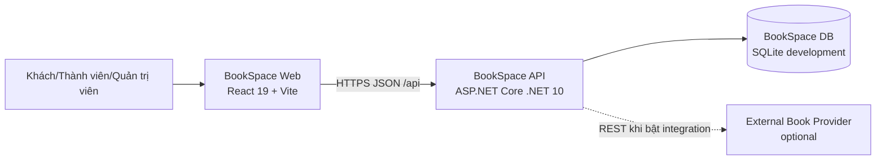
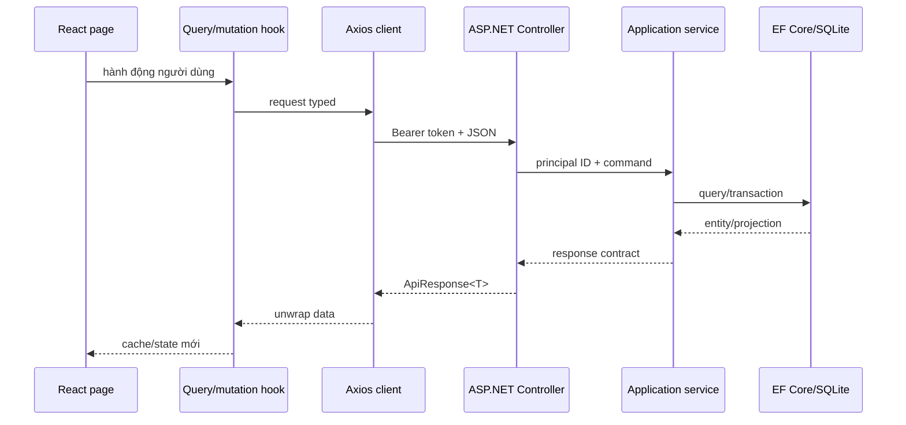

# BookSpace — Kiến trúc hệ thống

> Kiến trúc Goal 1: modular monolith ASP.NET Core + SPA React + database riêng.

## 1. System context



BookSpace Web, API và database tạo thành một sản phẩm tự chủ. Provider ngoài nằm ngoài trust boundary và không tham gia luồng authentication, library, reading, community, club, challenge hoặc notification.

## 2. Lựa chọn kiến trúc

### 2.1 Modular monolith

Goal 1 dùng một API deployable và một database vì:

- Bounded context đã tách ở code/domain nhưng quy mô chưa cần microservice.
- Transaction cho session/library/challenge và club/owner cần tính nhất quán.
- Vận hành local, test và deploy đơn giản.
- Không đưa message broker, service discovery hoặc distributed transaction vào MVP.

Ranh giới context vẫn được giữ bằng namespace, service interface và repository abstraction để có thể tách sau này khi có nhu cầu đo được.

### 2.2 Clean Architecture

Quy tắc dependency:

```text
BookSpace.Domain
        ↑
BookSpace.Application
        ↑
BookSpace.Infrastructure
        ↑
BookSpace.Api
```

Diễn giải:

- `Domain` không reference ASP.NET Core, EF Core, JWT, SQLite hoặc HTTP client.
- `Application` reference `Domain`, định nghĩa use case, contract và abstraction.
- `Infrastructure` reference `Application` + `Domain`, triển khai persistence, auth, provider và seed.
- `Api` là composition root, reference `Application` + `Infrastructure`, chứa controller/middleware/config.
- Controller không truy cập `DbContext` trực tiếp.
- EF entity chính là domain entity trong Goal 1; mapping được cấu hình ở Infrastructure, không đặt annotation persistence vào Domain.

## 3. Cấu trúc repository

```text
T:\bookspace\
├── backend\
│   ├── BookSpace.slnx
│   ├── src\
│   │   ├── BookSpace.Domain\
│   │   │   ├── Common\
│   │   │   ├── Entities\
│   │   │   ├── Enums\
│   │   │   └── Exceptions\
│   │   ├── BookSpace.Application\
│   │   │   ├── Abstractions\
│   │   │   ├── Common\
│   │   │   ├── Contracts\
│   │   │   └── Services\
│   │   ├── BookSpace.Infrastructure\
│   │   │   ├── Authentication\
│   │   │   ├── Integrations\
│   │   │   ├── Persistence\
│   │   │   ├── Seeding\
│   │   │   └── DependencyInjection.cs
│   │   └── BookSpace.Api\
│   │       ├── Controllers\
│   │       ├── Middleware\
│   │       ├── Properties\
│   │       ├── Program.cs
│   │       └── appsettings*.json
│   └── tests\
│       ├── BookSpace.UnitTests\
│       └── BookSpace.IntegrationTests\
├── frontend\
│   ├── public\
│   ├── src\
│   │   ├── app\
│   │   ├── components\
│   │   ├── contexts\
│   │   ├── hooks\
│   │   ├── lib\
│   │   ├── pages\
│   │   ├── routes\
│   │   ├── services\
│   │   └── types\
│   ├── Dockerfile
│   ├── nginx.conf
│   ├── package.json
│   └── vite.config.ts
├── docs\
├── scripts\
│   ├── run-local.ps1
│   └── verify.ps1
├── .env.example
├── docker-compose.yml
└── README.md
```

Tên solution hiện hành là `BookSpace.slnx`. Script build/test phải trỏ đúng file này hoặc build theo project; không giả định tồn tại `BookSpace.sln`.

## 4. Backend design

### 4.1 Domain layer

Chứa:

- Entity và hành vi bảo vệ invariant.
- Enum nghiệp vụ.
- `Entity` base với UUID, audit timestamp và soft delete.
- `Guard` cho invariant cục bộ.
- `DomainException` có `code` ổn định.

Domain không trả DTO và không nhận request model.

### 4.2 Application layer

Mỗi use case được tiếp cận qua interface:

| Service | Trách nhiệm |
|---|---|
| `IAuthService` | register, login, refresh, logout, me |
| `IUserService` | hồ sơ, follow, followers/following |
| `IOnboardingService` | owner-private preference draft, complete/skip state machine |
| `ICatalogService` | catalog công khai, recommendation read model theo principal và admin CRUD |
| `IReadingService` | library, progress, completed-session correction và Focus Reading lifecycle |
| `ICommunityService` | review, like, comment, feed |
| `IClubService` | club settings, invitations, membership roles, shared current book, post/comment |
| `IClubChatService` | member-only history, send, unread high-water và read marker |
| `IDirectMessageService` | mutual-follow conversation, private history, send, unread/read marker |
| `IBookListService` | ownership/privacy, CRUD list, add/remove/reorder và public profile projection |
| `IClubReadingSprintService` | sprint lifecycle, participant state, progress, leaderboard, timeline, milestone/response và reminder |
| `IChallengeService` | challenge, join, progress, publish |
| `INotificationService` | list, unread count, mark read |
| `IDashboardService` | projection dashboard của principal |
| `IExternalCatalogService` | tìm metadata ngoài và import có kiểm duyệt vào catalog nội bộ |

Application:

- Nhận principal ID từ controller, không tin `userId` trong body.
- Kiểm tra ownership/RBAC trước khi mutation.
- Điều phối transaction.
- Chuyển domain entity thành contract response.
- Ném `UseCaseException` có code và HTTP status cho lỗi use-case.

Recommendation là query/use case của Application trên các abstraction dữ liệu
hiện có, không phải aggregate mới. `ICatalogService` nhận principal từ controller,
loại book trong own library, own review hoặc onboarding reference books rồi tính
vector social/author/category/global review theo hợp đồng trước khi count/phân trang.
Query hợp nhất author/category từ reference books và explicit preferred categories
với own library/review; chỉ đọc review công khai của followed user active, không
load preference/library/session/note của user khác. Không có model ML, provider
ngoài hoặc server cache riêng cho read model này.

`IOnboardingService` cũng nhận principal từ controller và trả duy nhất state gồm
status/timestamp cùng hai mảng catalog ID. PUT full-replace cho phép draft 0–5 khi
state là `PENDING`/`SKIPPED`, nhưng giữ invariant 3–5 target active mỗi tập khi state
đã `COMPLETED`; command chuyển state sang complete cũng revalidate cùng invariant. Các quick action add-library,
follow và create-goal vẫn gọi service hiện hữu, không tạo transaction xuyên bounded
context và không trở thành điều kiện complete.

PUT/complete/skip onboarding dùng `IOnboardingMutationBoundary` với SQLite immediate
transaction để tuần tự hóa toàn bộ read-check-write. Vì vậy concurrent skip hoặc
draft update không thể ghi đè một completion đã commit hay làm terminal state thiếu
preference; GET vẫn là read-only và không lấy write lock.

### 4.3 Infrastructure layer

Chứa:

- `BookSpaceDbContext` và EF Core configuration.
- `User.OnboardingStatus`/`OnboardingFinishedAt` cùng hai association
  `UserPreferredCategory` và `UserReferenceBook`; preference association là dữ liệu
  disposable nên PUT hard-replace atomically, kể cả row bị global filter che vì
  target đã soft-delete; restore target không được làm preference cũ xuất hiện lại.
- Global query filter cho `DeletedAt`.
- Unique index theo invariant.
- Triển khai service hoặc repository/adapter theo interface Application.
- Password hasher, JWT issuer, password-reset token issuer và email delivery `Disabled/Log/SMTP`.
- Refresh token hashing.
- Development seeder.
- `IExternalBookProvider` adapter và `HttpClient`.
- `ExternalBookLink` lưu ánh xạ `(provider, externalId) -> Book.Id` để import idempotent.

Các unique index bắt buộc:

| Entity | Index |
|---|---|
| `User` | unique normalized email khi active |
| `RefreshToken` | unique token hash |
| `PasswordResetToken` | unique token hash; index `(UserId, CreatedAt)`; `UsedAt` concurrency token |
| `Follow` | unique `(FollowerId, FollowingId)` |
| `UserBlock` | unique `(BlockerId, BlockedUserId)`; reverse lookup `(BlockedUserId, BlockerId)` |
| `UserMute` | unique `(UserId, MutedUserId)`; reverse lookup `(MutedUserId, UserId)` |
| `Book` | unique ISBN khi ISBN khác null và active |
| `Category` | unique normalized name khi active |
| `BookAuthor` | unique `(BookId, AuthorId)` |
| `BookCategory` | unique `(BookId, CategoryId)` |
| `LibraryItem` | unique `(UserId, BookId)` toàn lifecycle; re-add/focus start restore soft-deleted row |
| `ActiveReadingSession` | unique `UserId`; mỗi principal tối đa một focus session |
| `Review` | unique `(UserId, BookId)` khi active |
| `ReviewLike` | unique `(ReviewId, UserId)` |
| `BookClubMember` | unique active `(ClubId, UserId)` |
| `ClubChatMessage` | history `(ClubId, CreatedAt, Id)` |
| `ClubChatReadState` | unique `MembershipId` |
| `Conversation` | unique normalized `(UserOneId, UserTwoId)`; inbox `(LastActivityAt, Id)` |
| `DirectMessage` | history `(ConversationId, CreatedAt, Id)` |
| `DirectMessageReadState` | unique `(ConversationId, UserId)` |
| `BookList` | filtered unique `(OwnerId, NormalizedName)`; owner/visibility/update index |
| `BookListItem` | unique `(BookListId, BookId)` toàn lifecycle; order `(BookListId, Position)` |
| `ClubInvitation` | unique pending `(ClubId, InvitedUserId)`; inbox index `(InvitedUserId, Status, ExpiresAt)` |
| `ClubReadingSprint` | `(ClubId, CreatedAt)`; status-filter support `(ClubId, StartsAt, EndsAt, CompletedAt, CancelledAt)` |
| `ClubReadingSprintParticipant` | unique `(SprintId, UserId)`; leaderboard `(SprintId, LeftAt, ProgressValue)` |
| `ClubReadingSprintCheckIn` | timeline `(SprintId, CreatedAt)` |
| `ClubReadingSprintMilestone` | `(SprintId, TargetValue)` |
| `ClubReadingSprintMilestoneResponse` | thread `(MilestoneId, CreatedAt)` |
| `ChallengeParticipation` | unique `(ChallengeId, UserId)` |
| `ContentReport` | unique pending `(ReporterId, TargetType, TargetId)`; queue `(Status, CreatedAt, Id)` và target `(TargetType, TargetId)` |

### 4.4 API layer

Controller chịu trách nhiệm:

- Route, HTTP status và binding.
- `[Authorize]`/role policy.
- Đọc `sub` từ JWT.
- Gọi một application service.
- Bọc response bằng `ApiResponse<T>`.

Middleware/exception handler:

- Map `DomainException`, `UseCaseException`, validation, auth và lỗi không dự kiến.
- Không trả stack trace, SQL, connection string hoặc secret.
- Ghi correlation ID trong log.

API có:

- OpenAPI ở Development.
- `/health` không cần auth, chỉ trả trạng thái tối thiểu.
- CORS theo allowlist.
- JSON enum dạng string.
- SignalR hub authenticated ở `/hubs/club-chat` và `/hubs/direct-messages`; query token
  chỉ được chấp nhận cho đúng hai hub path. Hub outbound-only, còn persistence/validation
  đi qua REST.

## 5. Frontend design

### 5.1 Stack

- React 19.
- TypeScript 6 strict.
- Vite 8.
- React Router 7.
- TanStack Query 5.
- Axios.
- SignalR client dùng một connection toàn app cho Direct Messages và connection theo
  panel cho club chat; cả hai tự reconnect và refetch REST sau reconnect.
- Tailwind CSS 4.
- Oxlint.

### 5.2 Phân lớp

```text
pages/routes
    ↓
feature hooks + TanStack Query
    ↓
domain services
    ↓
shared Axios client
    ↓
/api
```

- `types/api.ts`: `ApiResponse<T>`, `PageResult<T>`.
- `types/domain.ts`: type phản ánh chính xác response models.
- `services/*.service.ts`: URL, method, request/response generic; không giữ UI state.
- `hooks/*`: query key, cache invalidation, mutation và optimistic UI có rollback.
- `contexts/AuthContext.tsx`: session/auth lifecycle.
- `contexts/ThemeContext.tsx`: theme thuần frontend.
- `pages/*`: composition, không gọi Axios trực tiếp.

### 5.3 Routing và access control

Route công khai, protected và admin được liệt kê trong `PRODUCT_SPEC.md`.

- `ProtectedRoute` chờ auth bootstrap trước khi redirect.
- Chưa đăng nhập vào protected route: chuyển `/login`, giữ intended location.
- Role không hợp lệ vào admin route: chuyển về `/` hoặc trang 403.
- Backend vẫn là nguồn phân quyền cuối cùng.
- Mỗi page được lazy-load.
- Query lỗi 401 thử refresh đúng một lần; refresh thất bại thì xóa session và về login.
- Register thành công điều hướng tới `/onboarding` và chỉ giữ `location.state.from`
  khi đó là đường dẫn nội bộ an toàn. Complete/skip quay về đường dẫn này, mặc định
  `/dashboard`; login thông thường không bị ép qua onboarding.
- Dashboard có CTA tiếp tục khi state chưa `COMPLETED`. Settings mở chế độ chỉnh sửa
  qua `/onboarding?mode=edit` và quay lại `/settings` sau khi lưu.

### 5.4 Cache key

Query key tối thiểu:

```text
["me"]
["onboarding", principalScope]
["books", filters]
["book", bookId]
["book-recommendations", principalScope, page, pageSize]
["authors"]
["categories"]
["library", filters]
["reading-sessions", filters]
["reading-sessions", "active"]
["book-reviews", bookId, paging]
["review-comments", reviewId, paging]
["people", principalScope, "search", search, paging]
["people", principalScope, "suggestions", paging]
["users", principalScope, "detail", userId]
["feed", principalScope, { type, page, pageSize }]
["clubs", filters]
["club", principalScope, clubId]
["club-posts", clubId, paging]
["club-chat", principalScope, clubId, cursor]
["club-chat-unread", principalScope, clubId]
["direct-messages", principalScope, "inbox"]
["direct-messages", principalScope, "conversation", conversationId]
["direct-messages", principalScope, "conversation", conversationId, "messages"]
["direct-messages", principalScope, "unread"]
["challenges", paging]
["my-challenges", paging]
["notifications", filters]
["notification-unread-count"]
["user-safety", principalScope, paging]
["dashboard"]
```

Mutation phải invalidate đúng consumer:

- Library/progress/completed-session: `library`, `book`, `book-recommendations`, `reading-sessions`, `feed`, `dashboard`, `reading-goals`, `reading-insights`, `challenges`, `notifications`.
- Onboarding PUT/complete/skip ghi response authoritative vào key `onboarding` của
  principal rồi invalidate `book-recommendations`, `library`, people scope,
  `dashboard` và `reading-goals`; key có principal ID để draft không thể dùng lại
  giữa hai account.
- Focus start/pause/resume/cancel cập nhật `reading-sessions/active`; finish đồng thời invalidate active key và toàn bộ consumer của completed session.
- Review create/update/delete: `book-reviews`, `book`, `book-recommendations`, `feed`, `notifications`.
- Review like/comment: `book-reviews`, `feed`, `notifications`.
- Follow: principal-scoped `people`, target/current `users`, `followers`,
  `following`, `book-recommendations`, `feed`, `dashboard`; mutation cùng target
  dùng shared pending key.
- Block/mute: principal-scoped `user-safety`, `people`, `users`, `feed`,
  `book-recommendations`, `book-reviews`, club post/comment/chat/unread,
  Direct Messages inbox/thread/unread, `notifications` và `dashboard`. Block còn loại
  cache profile target ngay sau success.
- Club/member/post/comment: `clubs`, `club`, `club-posts`, `club-comments`, `feed`.
- Club chat send/read/realtime: merge theo `message.id`, invalidate history/unread
  của đúng principal; reconnect refetch trang mới nhất thay vì tin hoàn toàn vào event stream.
- Direct message send/read/realtime: merge theo `message.id`, invalidate inbox/detail/
  unread và notification scope; REST là nguồn sự thật và reconnect refetch toàn scope.
- Book list mutations invalidate namespace `book-lists`; query key chứa principal để dữ liệu
  private không đi qua phiên đăng nhập khác. Profile dùng endpoint mine cho chủ sở hữu và
  public endpoint cho người xem khác.
- Reading sprint: list/detail/history, participant state, leaderboard, timeline và milestone; mutation đồng thời invalidate club detail và notification khi có recipient.
- Challenge: `challenges`, `my-challenges`, `feed`, `dashboard`, `notifications`.
- Mark notification: `notifications`, `notification-unread-count`.

Onboarding/recommendation query chỉ bật sau auth bootstrap và key luôn chứa principal ID để
không chia sẻ dữ liệu giữa guest/account. Quick-add `WANT_TO_READ`, library
add/update/remove, reading-session create, review create/update/delete và
follow/unfollow phải invalidate key này. Vì backend tính read model từ dữ liệu
hiện tại và không cache riêng, refetch sau mutation là freshness boundary; quick-add
thành công làm candidate biến mất theo quy tắc loại sách principal đã biết.

## 6. Request flow



## 7. Authentication và authorization

### 7.1 Password

- Hash bằng implementation chuẩn của ASP.NET Core.
- Không tự thiết kế thuật toán hash.
- Không log password hoặc password hash.
- Login trả cùng lỗi cho email không tồn tại và mật khẩu sai.

### 7.2 Access token

- JWT issuer: `BookSpace`.
- Audience: `BookSpace.Web`.
- Claims bắt buộc: `sub`, `role`, `jti`, `iat`, `exp`; `role` chỉ là `USER` hoặc `ADMIN`.
- Claim `bookspace_auth_version` được so với `User.AuthVersion`; token cũ bị từ chối ngay sau khi đổi mật khẩu.
- TTL cấu hình, khuyến nghị 15 phút.
- Signing key lấy từ secret/environment, không hard-code.

### 7.3 Refresh token

- Opaque random token, database chỉ lưu hash.
- TTL cấu hình, khuyến nghị 30 ngày.
- Rotate khi refresh.
- Logout thu hồi token.
- Token reuse sau rotate bị từ chối.

### 7.4 Khôi phục mật khẩu

- Request luôn trả cùng response để không dò được email đăng ký.
- Token có 48 byte entropy, truyền dưới dạng base64url và database chỉ lưu SHA-256.
- Token mặc định hết hạn sau 15 phút, chỉ dùng một lần và request cùng tài khoản có
  cooldown 60 giây ngoài rate limit theo IP.
- Xác nhận reset chạy trong `IAuthMutationBoundary`: đổi hash, tăng auth version, consume
  token và revoke toàn bộ refresh token trong cùng transaction.
- `PasswordRecovery:DeliveryMode=Disabled` là mặc định an toàn; `Log` chỉ phát link ở
  Development; `Smtp` là adapter Production và không liên quan Bookstore.
- Delivery thất bại không làm response tiết lộ tài khoản; token vừa tạo bị vô hiệu hóa.

### 7.5 RBAC và ownership

| Hành động | Policy |
|---|---|
| catalog/challenge mutation | `ADMIN` |
| onboarding state/preferences | authenticated principal only; admin không đọc preference user khác |
| profile/library/session của mình | authenticated owner |
| review/comment/post mutation | author; `ADMIN` chỉ xóa khi contract cho phép moderation |
| club post/comment | active club member |
| sửa club hoặc đổi role thành viên | `ClubMemberRole.OWNER` |
| mời/thu hồi lời mời, chọn sách chung | `ClubMemberRole.OWNER` hoặc `MODERATOR` |
| loại thành viên | owner loại member/moderator; moderator chỉ loại member thường |
| accept/decline lời mời | đúng principal được mời |
| tạo/sửa/complete/cancel sprint, milestone và reminder | `ClubMemberRole.OWNER` hoặc `MODERATOR` |
| join/leave sprint | active club member; owner/moderator không được đặc cách bỏ qua membership |
| ghi progress hoặc tạo phản hồi milestone | active club member đồng thời là active sprint participant |
| đọc sprint private, leaderboard và timeline | active member của đúng club |
| xóa phản hồi milestone | response author hoặc `OWNER`/`MODERATOR` của club |
| notification/dashboard | principal only |
| mở/gửi direct message | hai active user mutual-follow, không block nhau; chỉ participant đọc lịch sử |
| block/mute/list safety | authenticated principal; không tự chặn hoặc tự ẩn |
| tạo report | authenticated principal; target phải đang nhìn thấy được và không thuộc chính principal |
| đọc/xử lý report | `ADMIN`; không tự xử lý report nhắm đến nội dung của mình, không khóa admin |

JWT validation kiểm tra user còn tồn tại và chưa bị khóa ở mỗi request, kể cả
kết nối SignalR mới. Vì vậy `USER_LOCKED` vô hiệu hóa access token hiện có mà
không cần chia sẻ signing secret hoặc token store với hệ thống khác.

## 8. Persistence

### 8.1 Development

- SQLite là provider mặc định.
- Connection string local trỏ file nằm trong backend/runtime data.
- Docker mount volume `bookspace-data` vào `/app/data`.
- Seed chỉ chạy khi `ASPNETCORE_ENVIRONMENT=Development`.
- Migration lưu `OnboardingStatus`/`OnboardingFinishedAt` trên user và hai bảng
  `user_preferred_categories`, `user_reference_books` có FK vào catalog BookSpace,
  unique theo cặp owner-target. Không có database hay provider bên ngoài tham gia.

### 8.2 Production

Goal 1 không bắt buộc provider production khác. Nếu chuyển PostgreSQL/SQL Server:

- Giữ abstraction EF Core.
- Tạo migration riêng cho provider.
- Kiểm tra filtered unique index và datetime UTC.
- Không dùng cùng schema/database instance do Bookstore quản lý.

### 8.3 Migration và seed

- Schema được version bằng EF Core migration.
- Startup không tự xóa database.
- Seed idempotent theo email/unique key.
- Seed không ghi đè dữ liệu người dùng.
- Production không tạo tài khoản demo.

## 9. Configuration

| Key | Bắt buộc | Giá trị local |
|---|---:|---|
| `ASPNETCORE_ENVIRONMENT` | có | `Development` |
| `ASPNETCORE_URLS` | có trong container | `http://+:8080` |
| `ConnectionStrings__DefaultConnection` | có | `Data Source=/app/data/bookspace.db` |
| `Jwt__Issuer` | có | `BookSpace` |
| `Jwt__Audience` | có | `BookSpace.Web` |
| `Jwt__Key` | có | secret local đủ dài |
| `Cors__AllowedOrigins__0` | có | `http://localhost:5173` |
| `BOOKSPACE_BookstoreIntegration__Enabled` | không | `false` |
| `BOOKSPACE_BookstoreIntegration__BaseUrl` | khi bật | URL API Bookstore, gồm `/api` |
| `VITE_API_BASE_URL` | có khi build web | `http://localhost:5080/api` |

Giá trị mặc định Docker của `Jwt__Key` chỉ dùng local. Deployment production phải cung cấp secret mới.

## 10. Docker topology

```text
localhost:5173 ──> nginx + React static
                         │
                         └── browser gọi localhost:5080/api

localhost:5080 ──> ASP.NET container:8080 ──> /app/data/bookspace.db
```

`web` chỉ được coi là ready sau khi `api` health check thành công. Health check không gọi Bookstore provider.

## 11. Giao dịch và consistency

| Use case | Transaction |
|---|---|
| register | user + refresh token nếu auto-login |
| refresh | revoke token cũ + create token mới |
| onboarding preference replace | validate toàn bộ target + hard-replace cả hai association |
| onboarding complete/skip | state + finished timestamp; retry không phát side effect |
| create club | club + owner membership |
| start direct conversation | normalized pair + unique conversation trong SQLite immediate transaction |
| send direct message | message + conversation activity + notification preference check; realtime sau commit |
| mark direct message read | unique state + monotonic high-water marker |
| join/rejoin sprint | tái kích hoạt hoặc tạo đúng một participant |
| sprint progress | participant progress + một timeline activity khi giá trị thực sự tăng |
| sprint milestone response | tạo thread item mới; soft-delete bởi author hoặc club manager |
| sprint reminder | daily marker + notification cho từng active participant trong cùng lần lưu |
| complete/cancel sprint | đổi terminal status đúng một lần; lần gọi lại không phát sinh side effect |
| reading session | session + library update |
| challenge progress đạt target | participation + completedAt + notification |
| follow | follow + notification |
| review like/comment | interaction + notification |

Read model dashboard/feed có consistency ngay trong monolith. Không cần eventual consistency trong Goal 1.

## 12. Integration boundary

Application chỉ biết `IExternalBookProvider`. Infrastructure đăng ký
`ExternalBookProvider`; adapter này short-circuit khi config tắt và gọi/mapping
Bookstore khi config bật. Provider khác trong tương lai phải là adapter riêng.

Import gọi `GetByIdAsync` và hoàn tất outbound HTTP trước khi lấy SQLite immediate
transaction. Trong transaction, `IExternalCatalogService` kiểm tra link nguồn, đối
sánh ISBN chuẩn hóa, ghép hoặc tạo author/category rồi lưu `Book` và `ExternalBookLink`
atomically. Retry một link đã lưu đọc hoàn toàn từ BookSpace DB, kể cả khi provider
sau đó không khả dụng.

Reading sprint chỉ tham chiếu `Book.Id` của catalog BookSpace. Mọi command/query
sprint, permission, leaderboard, timeline, milestone và notification phải hoàn
thành khi provider bị tắt hoặc lỗi; không đặt outbound call trong transaction.

Mọi DTO ngoài đi qua anti-corruption mapping trước khi tới Application. Chi tiết ở `INTEGRATION_WITH_BOOKSTORE.md`.

## 13. Logging và health

Log cấu trúc phải có:

- timestamp UTC;
- log level;
- correlation/request ID;
- HTTP method + route template;
- status code + elapsed time;
- exception code đã chuẩn hóa;
- user ID khi đã xác thực, không log token.

Middleware chấp nhận `X-Correlation-ID` chỉ khi giá trị đơn, dài tối đa 128 ký tự
và chỉ chứa chữ, số, `.`, `_`, `-`; trường hợp khác server tạo ID mới. ID được gắn
vào `HttpContext.TraceIdentifier`, logging scope và response header. Request log chỉ
ghi route/path, không ghi query/body/header xác thực, đồng thời phát một completion
event có method, route template, status, elapsed milliseconds và user ID nếu có.

`GET /health`:

- kiểm tra process và database BookSpace;
- không trả connection string;
- không gọi provider ngoài;
- trả 200 khi core app hoạt động dù integration tắt/lỗi.

Health check database dùng scope riêng và `CanConnectAsync`, timeout sau 5 giây;
lỗi chỉ trả trạng thái `Unhealthy`/503 tối thiểu và không gắn raw exception vào
health result để tránh log provider detail, connection string hoặc đường dẫn máy.

Login và refresh dùng hai rate-limit policy độc lập, partition theo địa chỉ client,
không queue request vượt ngưỡng và trả envelope 429 `RATE_LIMITED` kèm `Retry-After`.
Giới hạn/cửa sổ được cấu hình để môi trường Production có thể điều chỉnh mà không
đổi code; middleware không log email, mật khẩu hay refresh token.

`UseForwardedHeaders` chạy trước observability/rate limiting và chỉ tin
`X-Forwarded-For`/`X-Forwarded-Proto` từ loopback hoặc IP/CIDR được khai báo trong
`ForwardedHeaders:KnownProxies`/`KnownNetworks`; mặc định chỉ xử lý một proxy hop.
Không đọc trực tiếp forwarded header từ nguồn chưa tin cậy. CORS expose
`X-Correlation-ID` và `Retry-After` cho frontend.

## 14. Quality gates

Backend:

```powershell
dotnet restore T:\bookspace\backend\BookSpace.slnx
dotnet build T:\bookspace\backend\BookSpace.slnx --no-restore
dotnet test T:\bookspace\backend\BookSpace.slnx --no-build
```

Frontend:

```powershell
npm ci
npm run typecheck
npm run lint
npm run build
```

Script `scripts/verify.ps1` chạy các gate build/test/format cục bộ. Workflow
`.github/workflows/ci.yml` chạy lại các gate đó và bổ sung EF model-drift cùng
Docker Compose config. CI dùng lockfile qua `npm ci`, cache NuGet/npm, hủy run cũ
cùng branch, pin action Node 24 theo commit SHA và chỉ yêu cầu quyền `contents: read`.
Dependabot kiểm tra cập nhật GitHub Actions hàng tuần mà không nới quyền workflow.
Script kiểm tra exit code sau từng native command để một gate lỗi không bị lệnh kế
tiếp che mất trên Windows PowerShell 5.1.

Chạy frontend trong `T:\bookspace\frontend`.

System:

```powershell
docker compose -f T:\bookspace\docker-compose.yml config
docker compose -f T:\bookspace\docker-compose.yml up --build
```

Sau khi chạy, xác minh:

- `http://localhost:5080/health` trả 200.
- `http://localhost:5173` render ứng dụng.
- đăng nhập seed gọi API thật thành công.
- `BOOKSPACE_BookstoreIntegration__Enabled=false` không tạo lỗi startup.

## 15. Architecture constraints cần kiểm tra bằng test/review

- Không project reference ngược dependency rule.
- Không controller query EF Core trực tiếp.
- Không frontend page gọi Axios trực tiếp.
- Không entity domain chứa attribute EF/JSON/HTTP.
- Không Bookstore database connection string trong BookSpace.
- Không chấp nhận token Bookstore như token BookSpace.
- Không lưu refresh token thô.
- Không trả entity trực tiếp từ controller.
- Không hard-delete aggregate có lịch sử nghiệp vụ.
- Không để Bookstore tham gia transaction, authorization, catalog identity hoặc vòng đời reading sprint.
- Không dùng mock data cho route Goal 1 sau khi API sẵn sàng.
