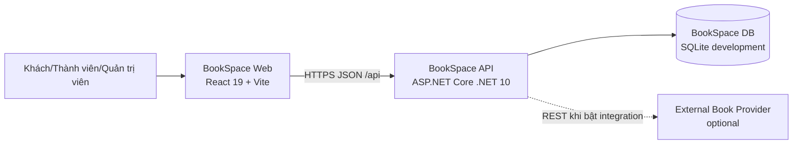
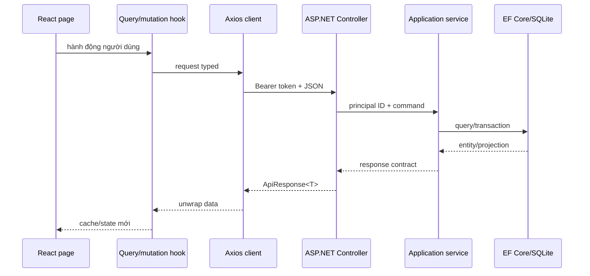

# BookSpace — Kiến trúc hệ thống

> Kiến trúc Goal 1: modular monolith ASP.NET Core + SPA React + database riêng.

## 1. System context



BookSpace Web, API và database tạo thành một sản phẩm tự chủ. Provider ngoài nằm ngoài trust boundary và không tham gia luồng authentication, library, reading, community, club, challenge hoặc notification.

## 2. Lựa chọn kiến trúc

### 2.1 Modular monolith

Goal 1 dùng một API deployable và một database vì:

- Bounded context đã tách ở code/domain nhưng quy mô chưa cần microservice.
- Transaction cho session/library/challenge và club/owner cần tính nhất quán.
- Vận hành local, test và deploy đơn giản.
- Không đưa message broker, service discovery hoặc distributed transaction vào MVP.

Ranh giới context vẫn được giữ bằng namespace, service interface và repository abstraction để có thể tách sau này khi có nhu cầu đo được.

### 2.2 Clean Architecture

Quy tắc dependency:

```text
BookSpace.Domain
        ↑
BookSpace.Application
        ↑
BookSpace.Infrastructure
        ↑
BookSpace.Api
```

Diễn giải:

- `Domain` không reference ASP.NET Core, EF Core, JWT, SQLite hoặc HTTP client.
- `Application` reference `Domain`, định nghĩa use case, contract và abstraction.
- `Infrastructure` reference `Application` + `Domain`, triển khai persistence, auth, provider và seed.
- `Api` là composition root, reference `Application` + `Infrastructure`, chứa controller/middleware/config.
- Controller không truy cập `DbContext` trực tiếp.
- EF entity chính là domain entity trong Goal 1; mapping được cấu hình ở Infrastructure, không đặt annotation persistence vào Domain.

## 3. Cấu trúc repository

```text
T:\bookspace\
├── backend\
│   ├── BookSpace.slnx
│   ├── src\
│   │   ├── BookSpace.Domain\
│   │   │   ├── Common\
│   │   │   ├── Entities\
│   │   │   ├── Enums\
│   │   │   └── Exceptions\
│   │   ├── BookSpace.Application\
│   │   │   ├── Abstractions\
│   │   │   ├── Common\
│   │   │   ├── Contracts\
│   │   │   └── Services\
│   │   ├── BookSpace.Infrastructure\
│   │   │   ├── Authentication\
│   │   │   ├── Integrations\
│   │   │   ├── Persistence\
│   │   │   ├── Seeding\
│   │   │   └── DependencyInjection.cs
│   │   └── BookSpace.Api\
│   │       ├── Controllers\
│   │       ├── Middleware\
│   │       ├── Properties\
│   │       ├── Program.cs
│   │       └── appsettings*.json
│   └── tests\
│       ├── BookSpace.UnitTests\
│       └── BookSpace.IntegrationTests\
├── frontend\
│   ├── public\
│   ├── src\
│   │   ├── app\
│   │   ├── components\
│   │   ├── contexts\
│   │   ├── hooks\
│   │   ├── lib\
│   │   ├── pages\
│   │   ├── routes\
│   │   ├── services\
│   │   └── types\
│   ├── Dockerfile
│   ├── nginx.conf
│   ├── package.json
│   └── vite.config.ts
├── docs\
├── scripts\
│   ├── run-local.ps1
│   └── verify.ps1
├── .env.example
├── docker-compose.yml
└── README.md
```

Tên solution hiện hành là `BookSpace.slnx`. Script build/test phải trỏ đúng file này hoặc build theo project; không giả định tồn tại `BookSpace.sln`.

## 4. Backend design

### 4.1 Domain layer

Chứa:

- Entity và hành vi bảo vệ invariant.
- Enum nghiệp vụ.
- `Entity` base với UUID, audit timestamp và soft delete.
- `Guard` cho invariant cục bộ.
- `DomainException` có `code` ổn định.

Domain không trả DTO và không nhận request model.

### 4.2 Application layer

Mỗi use case được tiếp cận qua interface:

| Service | Trách nhiệm |
|---|---|
| `IAuthService` | register, login, refresh, logout, me |
| `IUserService` | hồ sơ, follow, followers/following |
| `ICatalogService` | catalog công khai và admin CRUD |
| `IReadingService` | library, progress, reading session |
| `ICommunityService` | review, like, comment, feed |
| `IClubService` | club settings, invitations, membership roles, shared current book, post/comment |
| `IClubReadingSprintService` | sprint lifecycle, participant state, progress, leaderboard, timeline, milestone/response và reminder |
| `IChallengeService` | challenge, join, progress, publish |
| `INotificationService` | list, unread count, mark read |
| `IDashboardService` | projection dashboard của principal |
| `IExternalCatalogService` | tìm metadata ngoài qua provider |

Application:

- Nhận principal ID từ controller, không tin `userId` trong body.
- Kiểm tra ownership/RBAC trước khi mutation.
- Điều phối transaction.
- Chuyển domain entity thành contract response.
- Ném `UseCaseException` có code và HTTP status cho lỗi use-case.

### 4.3 Infrastructure layer

Chứa:

- `BookSpaceDbContext` và EF Core configuration.
- Global query filter cho `DeletedAt`.
- Unique index theo invariant.
- Triển khai service hoặc repository/adapter theo interface Application.
- Password hasher và JWT issuer.
- Refresh token hashing.
- Development seeder.
- `IExternalBookProvider` adapter và `HttpClient`.

Các unique index bắt buộc:

| Entity | Index |
|---|---|
| `User` | unique normalized email khi active |
| `RefreshToken` | unique token hash |
| `Follow` | unique `(FollowerId, FollowingId)` |
| `Book` | unique ISBN khi ISBN khác null và active |
| `Category` | unique normalized name khi active |
| `BookAuthor` | unique `(BookId, AuthorId)` |
| `BookCategory` | unique `(BookId, CategoryId)` |
| `LibraryItem` | unique `(UserId, BookId)` khi active |
| `Review` | unique `(UserId, BookId)` khi active |
| `ReviewLike` | unique `(ReviewId, UserId)` |
| `BookClubMember` | unique active `(ClubId, UserId)` |
| `ClubInvitation` | unique pending `(ClubId, InvitedUserId)`; inbox index `(InvitedUserId, Status, ExpiresAt)` |
| `ClubReadingSprint` | `(ClubId, CreatedAt)`; status-filter support `(ClubId, StartsAt, EndsAt, CompletedAt, CancelledAt)` |
| `ClubReadingSprintParticipant` | unique `(SprintId, UserId)`; leaderboard `(SprintId, LeftAt, ProgressValue)` |
| `ClubReadingSprintCheckIn` | timeline `(SprintId, CreatedAt)` |
| `ClubReadingSprintMilestone` | `(SprintId, TargetValue)` |
| `ClubReadingSprintMilestoneResponse` | thread `(MilestoneId, CreatedAt)` |
| `ChallengeParticipation` | unique `(ChallengeId, UserId)` |

### 4.4 API layer

Controller chịu trách nhiệm:

- Route, HTTP status và binding.
- `[Authorize]`/role policy.
- Đọc `sub` từ JWT.
- Gọi một application service.
- Bọc response bằng `ApiResponse<T>`.

Middleware/exception handler:

- Map `DomainException`, `UseCaseException`, validation, auth và lỗi không dự kiến.
- Không trả stack trace, SQL, connection string hoặc secret.
- Ghi correlation ID trong log.

API có:

- OpenAPI ở Development.
- `/health` không cần auth, chỉ trả trạng thái tối thiểu.
- CORS theo allowlist.
- JSON enum dạng string.

## 5. Frontend design

### 5.1 Stack

- React 19.
- TypeScript 6 strict.
- Vite 8.
- React Router 7.
- TanStack Query 5.
- Axios.
- Tailwind CSS 4.
- Oxlint.

### 5.2 Phân lớp

```text
pages/routes
    ↓
feature hooks + TanStack Query
    ↓
domain services
    ↓
shared Axios client
    ↓
/api
```

- `types/api.ts`: `ApiResponse<T>`, `PageResult<T>`.
- `types/domain.ts`: type phản ánh chính xác response models.
- `services/*.service.ts`: URL, method, request/response generic; không giữ UI state.
- `hooks/*`: query key, cache invalidation, mutation và optimistic UI có rollback.
- `contexts/AuthContext.tsx`: session/auth lifecycle.
- `contexts/ThemeContext.tsx`: theme thuần frontend.
- `pages/*`: composition, không gọi Axios trực tiếp.

### 5.3 Routing và access control

Route công khai, protected và admin được liệt kê trong `PRODUCT_SPEC.md`.

- `ProtectedRoute` chờ auth bootstrap trước khi redirect.
- Chưa đăng nhập vào protected route: chuyển `/login`, giữ intended location.
- Role không hợp lệ vào admin route: chuyển về `/` hoặc trang 403.
- Backend vẫn là nguồn phân quyền cuối cùng.
- Mỗi page được lazy-load.
- Query lỗi 401 thử refresh đúng một lần; refresh thất bại thì xóa session và về login.

### 5.4 Cache key

Query key tối thiểu:

```text
["me"]
["books", filters]
["book", bookId]
["authors"]
["categories"]
["library", filters]
["reading-sessions", filters]
["book-reviews", bookId, paging]
["review-comments", reviewId, paging]
["people", principalScope, "search", search, paging]
["people", principalScope, "suggestions", paging]
["users", principalScope, "detail", userId]
["feed", principalScope, { type, page, pageSize }]
["clubs", filters]
["club", clubId]
["club-posts", clubId, paging]
["challenges", paging]
["my-challenges", paging]
["notifications", filters]
["notification-unread-count"]
["dashboard"]
```

Mutation phải invalidate đúng consumer:

- Library/progress/session: `library`, `book`, `feed`, `dashboard`.
- Review/like/comment: `book-reviews`, `book`, `feed`, `notifications`.
- Follow: principal-scoped `people`, target/current `users`, `followers`,
  `following`, `feed`, `dashboard`; mutation cùng target dùng shared pending key.
- Club/member/post/comment: `clubs`, `club`, `club-posts`, `club-comments`, `feed`.
- Reading sprint: list/detail/history, participant state, leaderboard, timeline và milestone; mutation đồng thời invalidate club detail và notification khi có recipient.
- Challenge: `challenges`, `my-challenges`, `feed`, `dashboard`, `notifications`.
- Mark notification: `notifications`, `notification-unread-count`.

## 6. Request flow



## 7. Authentication và authorization

### 7.1 Password

- Hash bằng implementation chuẩn của ASP.NET Core.
- Không tự thiết kế thuật toán hash.
- Không log password hoặc password hash.
- Login trả cùng lỗi cho email không tồn tại và mật khẩu sai.

### 7.2 Access token

- JWT issuer: `BookSpace`.
- Audience: `BookSpace.Web`.
- Claims bắt buộc: `sub`, `role`, `jti`, `iat`, `exp`; `role` chỉ là `USER` hoặc `ADMIN`.
- TTL cấu hình, khuyến nghị 15 phút.
- Signing key lấy từ secret/environment, không hard-code.

### 7.3 Refresh token

- Opaque random token, database chỉ lưu hash.
- TTL cấu hình, khuyến nghị 30 ngày.
- Rotate khi refresh.
- Logout thu hồi token.
- Token reuse sau rotate bị từ chối.

### 7.4 RBAC và ownership

| Hành động | Policy |
|---|---|
| catalog/challenge mutation | `ADMIN` |
| profile/library/session của mình | authenticated owner |
| review/comment/post mutation | author; `ADMIN` chỉ xóa khi contract cho phép moderation |
| club post/comment | active club member |
| sửa club hoặc đổi role thành viên | `ClubMemberRole.OWNER` |
| mời/thu hồi lời mời, chọn sách chung | `ClubMemberRole.OWNER` hoặc `MODERATOR` |
| loại thành viên | owner loại member/moderator; moderator chỉ loại member thường |
| accept/decline lời mời | đúng principal được mời |
| tạo/sửa/complete/cancel sprint, milestone và reminder | `ClubMemberRole.OWNER` hoặc `MODERATOR` |
| join/leave sprint | active club member; owner/moderator không được đặc cách bỏ qua membership |
| ghi progress hoặc tạo phản hồi milestone | active club member đồng thời là active sprint participant |
| đọc sprint private, leaderboard và timeline | active member của đúng club |
| xóa phản hồi milestone | response author hoặc `OWNER`/`MODERATOR` của club |
| notification/dashboard | principal only |

## 8. Persistence

### 8.1 Development

- SQLite là provider mặc định.
- Connection string local trỏ file nằm trong backend/runtime data.
- Docker mount volume `bookspace-data` vào `/app/data`.
- Seed chỉ chạy khi `ASPNETCORE_ENVIRONMENT=Development`.

### 8.2 Production

Goal 1 không bắt buộc provider production khác. Nếu chuyển PostgreSQL/SQL Server:

- Giữ abstraction EF Core.
- Tạo migration riêng cho provider.
- Kiểm tra filtered unique index và datetime UTC.
- Không dùng cùng schema/database instance do Bookstore quản lý.

### 8.3 Migration và seed

- Schema được version bằng EF Core migration.
- Startup không tự xóa database.
- Seed idempotent theo email/unique key.
- Seed không ghi đè dữ liệu người dùng.
- Production không tạo tài khoản demo.

## 9. Configuration

| Key | Bắt buộc | Giá trị local |
|---|---:|---|
| `ASPNETCORE_ENVIRONMENT` | có | `Development` |
| `ASPNETCORE_URLS` | có trong container | `http://+:8080` |
| `ConnectionStrings__DefaultConnection` | có | `Data Source=/app/data/bookspace.db` |
| `Jwt__Issuer` | có | `BookSpace` |
| `Jwt__Audience` | có | `BookSpace.Web` |
| `Jwt__Key` | có | secret local đủ dài |
| `Cors__AllowedOrigins__0` | có | `http://localhost:5173` |
| `BOOKSPACE_BookstoreIntegration__Enabled` | không | `false` |
| `BOOKSPACE_BookstoreIntegration__BaseUrl` | khi bật | URL API Bookstore, gồm `/api` |
| `VITE_API_BASE_URL` | có khi build web | `http://localhost:5080/api` |

Giá trị mặc định Docker của `Jwt__Key` chỉ dùng local. Deployment production phải cung cấp secret mới.

## 10. Docker topology

```text
localhost:5173 ──> nginx + React static
                         │
                         └── browser gọi localhost:5080/api

localhost:5080 ──> ASP.NET container:8080 ──> /app/data/bookspace.db
```

`web` chỉ được coi là ready sau khi `api` health check thành công. Health check không gọi Bookstore provider.

## 11. Giao dịch và consistency

| Use case | Transaction |
|---|---|
| register | user + refresh token nếu auto-login |
| refresh | revoke token cũ + create token mới |
| create club | club + owner membership |
| join/rejoin sprint | tái kích hoạt hoặc tạo đúng một participant |
| sprint progress | participant progress + một timeline activity khi giá trị thực sự tăng |
| sprint milestone response | tạo thread item mới; soft-delete bởi author hoặc club manager |
| sprint reminder | daily marker + notification cho từng active participant trong cùng lần lưu |
| complete/cancel sprint | đổi terminal status đúng một lần; lần gọi lại không phát sinh side effect |
| reading session | session + library update |
| challenge progress đạt target | participation + completedAt + notification |
| follow | follow + notification |
| review like/comment | interaction + notification |

Read model dashboard/feed có consistency ngay trong monolith. Không cần eventual consistency trong Goal 1.

## 12. Integration boundary

Application chỉ biết `IExternalBookProvider`. Infrastructure đăng ký
`ExternalBookProvider`; adapter này short-circuit khi config tắt và gọi/mapping
Bookstore khi config bật. Provider khác trong tương lai phải là adapter riêng.

Reading sprint chỉ tham chiếu `Book.Id` của catalog BookSpace. Mọi command/query
sprint, permission, leaderboard, timeline, milestone và notification phải hoàn
thành khi provider bị tắt hoặc lỗi; không đặt outbound call trong transaction.

Mọi DTO ngoài đi qua anti-corruption mapping trước khi tới Application. Chi tiết ở `INTEGRATION_WITH_BOOKSTORE.md`.

## 13. Logging và health

Log cấu trúc phải có:

- timestamp UTC;
- log level;
- correlation/request ID;
- HTTP method + route template;
- status code + elapsed time;
- exception code đã chuẩn hóa;
- user ID khi đã xác thực, không log token.

`GET /health`:

- kiểm tra process và database BookSpace;
- không trả connection string;
- không gọi provider ngoài;
- trả 200 khi core app hoạt động dù integration tắt/lỗi.

## 14. Quality gates

Backend:

```powershell
dotnet restore T:\bookspace\backend\BookSpace.slnx
dotnet build T:\bookspace\backend\BookSpace.slnx --no-restore
dotnet test T:\bookspace\backend\BookSpace.slnx --no-build
```

Frontend:

```powershell
npm ci
npm run typecheck
npm run lint
npm run build
```

Chạy frontend trong `T:\bookspace\frontend`.

System:

```powershell
docker compose -f T:\bookspace\docker-compose.yml config
docker compose -f T:\bookspace\docker-compose.yml up --build
```

Sau khi chạy, xác minh:

- `http://localhost:5080/health` trả 200.
- `http://localhost:5173` render ứng dụng.
- đăng nhập seed gọi API thật thành công.
- `BOOKSPACE_BookstoreIntegration__Enabled=false` không tạo lỗi startup.

## 15. Architecture constraints cần kiểm tra bằng test/review

- Không project reference ngược dependency rule.
- Không controller query EF Core trực tiếp.
- Không frontend page gọi Axios trực tiếp.
- Không entity domain chứa attribute EF/JSON/HTTP.
- Không Bookstore database connection string trong BookSpace.
- Không chấp nhận token Bookstore như token BookSpace.
- Không lưu refresh token thô.
- Không trả entity trực tiếp từ controller.
- Không hard-delete aggregate có lịch sử nghiệp vụ.
- Không để Bookstore tham gia transaction, authorization, catalog identity hoặc vòng đời reading sprint.
- Không dùng mock data cho route Goal 1 sau khi API sẵn sàng.
