# BookSpace — Mô hình miền

> Đây là inventory entity và luật nghiệp vụ chuẩn cho Goal 1. 
> Tên C# dùng PascalCase; JSON dùng camelCase.

## 1. Quy ước chung

### 1.1 Identity và thời gian

- Mọi entity có `Id: Guid`; API biểu diễn bằng chuỗi UUID chuẩn.
- Aggregate/entity có vòng đời độc lập dùng `CreatedAt`, `UpdatedAt`, `DeletedAt?`.
- Join entity bất biến có thể chỉ dùng khóa ghép và `CreatedAt`.
- Mọi thời điểm lưu UTC bằng `DateTimeOffset`; API trả ISO 8601 có hậu tố `Z`.
- `DeletedAt != null` nghĩa là đã soft delete và bị loại khỏi truy vấn mặc định.
- Không sử dụng ID của Bookstore làm khóa chính BookSpace.

### 1.2 Chuẩn hóa dữ liệu

- Email: trim, lowercase để so sánh; giữ một giá trị chuẩn duy nhất.
- Chuỗi hiển thị: trim hai đầu; chuỗi chỉ có khoảng trắng được xem là rỗng.
- URL ảnh: `http`/`https`, tối đa 2.048 ký tự; có thể `null`.
- Nội dung người dùng nhập phải được render dạng text/Markdown đã sanitize, không render HTML thô.
- Phân trang bắt đầu từ trang 1.

### 1.3 Quyền sở hữu

- `ADMIN` có thể xóa review, comment và bài đăng vi phạm; không thể sửa hồ sơ người khác trong Goal 1.
- Chủ sở hữu được sửa/xóa nội dung của mình nếu entity còn hoạt động.
- Quyền `OWNER/MODERATOR/MEMBER` chỉ có ý nghĩa bên trong một câu lạc bộ.

## 2. Bounded context Identity & Profile

### 2.1 `User`

Aggregate root của tài khoản và hồ sơ.

| Trường | Kiểu | Bắt buộc | Quy tắc |
|---|---|---:|---|
| `Id` | `Guid` | có | tạo phía server |
| `Email` | `string` | có | email hợp lệ, unique không phân biệt hoa thường, tối đa 320 |
| `PasswordHash` | `string` | có | chỉ lưu hash qua password hasher, không trả API |
| `DisplayName` | `string` | có | 2–100 ký tự sau trim |
| `Bio` | `string?` | không | tối đa 500 ký tự |
| `AvatarUrl` | `string?` | không | URL hợp lệ, tối đa 1.000 |
| `Role` | `UserRole` | có | `USER` hoặc `ADMIN`; đăng ký công khai luôn là `USER` |
| `IsLocked` | `bool` | có | khóa đăng nhập nhưng không xóa dữ liệu |
| `IsReadingShelfPublic` | `bool` | có | mặc định `false`; cho phép người khác xem kệ sách chi tiết |
| `IsReadingActivityPublic` | `bool` | có | mặc định `false`; cho phép người khác xem timeline trên hồ sơ và hoạt động đọc trong feed |
| `IsFollowNotificationEnabled` | `bool` | có | mặc định `true`; nhận sự kiện follower mới |
| `IsReviewNotificationEnabled` | `bool` | có | mặc định `true`; nhận like/comment review |
| `IsClubNotificationEnabled` | `bool` | có | mặc định `true`; nhận sự kiện club và sprint |
| `IsChallengeNotificationEnabled` | `bool` | có | mặc định `true`; nhận sự kiện challenge |
| `CreatedAt` | `DateTimeOffset` | có | UTC |
| `UpdatedAt` | `DateTimeOffset` | có | không trước `CreatedAt` |
| `DeletedAt` | `DateTimeOffset?` | không | tài khoản bị vô hiệu hóa/soft delete |

Invariant:

- Email đang hoạt động là duy nhất.
- Không cho đăng nhập khi `DeletedAt` khác `null` hoặc `IsLocked=true`.
- Không cho client tự đặt `Role`.
- Xóa tài khoản thu hồi toàn bộ refresh token còn hiệu lực.
- Hồ sơ công khai không bao giờ lộ `PasswordHash`, token hoặc email nếu chính sách response không cho phép.
- Chủ hồ sơ luôn xem được kệ sách và activity của mình; viewer khác chỉ xem khi flag tương ứng là `true`.
- Hai flag công khai không thay đổi tính riêng tư tuyệt đối của `ReadingNote`, `ReadingSession.Note`, email hoặc token.

### 2.2 `RefreshToken`

Entity thuộc vòng đời xác thực của `User`.

| Trường | Kiểu | Quy tắc |
|---|---|---|
| `Id` | `Guid` | server tạo |
| `UserId` | `Guid` | FK tới `User` đang hoạt động |
| `TokenHash` | `string` | unique; không lưu token thô |
| `ExpiresAt` | `DateTimeOffset` | sau `CreatedAt` |
| `RevokedAt` | `DateTimeOffset?` | có giá trị khi logout/rotate/revoke |
| `ReplacedByTokenId` | `Guid?` | token mới trong chuỗi rotation |
| `CreatedAt` | `DateTimeOffset` | UTC |

Token hợp lệ khi chưa hết hạn, chưa thu hồi và user còn hoạt động. Refresh thành công phải thu hồi token cũ và tạo token mới.

### 2.3 `Follow`

Quan hệ có hướng giữa hai `User`.

| Trường | Kiểu | Quy tắc |
|---|---|---|
| `Id` | `Guid` | server tạo |
| `FollowerId` | `Guid` | người thực hiện follow |
| `FollowingId` | `Guid` | người được follow |
| `CreatedAt` | `DateTimeOffset` | UTC |

Invariant:

- `FollowerId != FollowingId`.
- Unique `(FollowerId, FollowingId)`.
- Cả hai user phải đang hoạt động.
- Unfollow xóa quan hệ; không ảnh hưởng nội dung lịch sử.

### 2.4 People Discovery read model

`UserDiscoveryItem` là projection công khai riêng, không phải entity và không
reuse `UserSummary` vì model đó có thể chứa email. Projection chỉ gồm `Id`,
`DisplayName`, `Bio`, `AvatarUrl`, `FollowerCount`, `BooksReadCount`,
`IsFollowing`, `FollowsYou`, `MutualFollowCount`, `Reason` và `ReasonText`.

Rule:

- Candidate phải chưa soft delete, không locked; suggestions còn loại principal
  và user principal đã follow.
- Search chỉ áp dụng trên `DisplayName`, trim input, không đọc email.
- SQLite query dùng `NOCASE`: không phân biệt hoa/thường cho ký tự ASCII, nhưng
  vẫn accent-sensitive và không tự gộp các dấu tiếng Việt khác nhau.
- Count, ranking, `Skip` và `Take` chạy trong database. Không materialize toàn bộ
  user IDs trước pagination và không map từng row bằng query riêng.
- `FollowerCount` dùng cùng observable relation count với public profile; locked
  user không là candidate nhưng relation hiện hành của họ vẫn được tính nhất quán.
- Suggestions xếp mutual follow giảm dần, tiếp theo follower count, books-read
  count, `DisplayName`, rồi `Id`; Application sở hữu thứ tự và reason ổn định.
- Không cần thêm column, migration hoặc index mới. Unique/index follow hiện hữu
  đủ cho v1; chỉ thêm normalized display name nếu có bằng chứng sản phẩm cần
  Unicode case folding rộng hơn SQLite `NOCASE`.

### 2.5 Public Reader Profile read models

`UserProfile` bổ sung `FollowsYou`, `MutualFollowCount` và `Privacy`. `Privacy`
chỉ mô tả khả năng xem hai phần hồ sơ, không phải quyền ghi dữ liệu.

`PublicLibraryItem` là projection riêng gồm book, shelf, phần trăm tiến độ và các
mốc bắt đầu/hoàn thành/cập nhật. Projection không trả library row owner fields,
trang hiện tại, reading session hoặc note. `ProfileActivity` dùng cùng `FeedItem`
nhưng chỉ lấy một actor; club post riêng tư chỉ hiện với viewer còn membership.
Review vẫn công khai độc lập với hai flag vì đã được người dùng chủ động đăng vào
community. Mọi danh sách đều phân trang và dùng thứ tự thời gian rồi `Id` để
tie-break ổn định.

## 3. Bounded context Catalog

### 3.1 `Author`

| Trường | Kiểu | Bắt buộc | Quy tắc |
|---|---|---:|---|
| `Id` | `Guid` | có | server tạo |
| `Name` | `string` | có | 1–160 ký tự |
| `Biography` | `string?` | không | tối đa 5.000 |
| `AvatarUrl` | `string?` | không | URL hợp lệ |
| `CreatedAt`, `UpdatedAt`, `DeletedAt?` | thời gian | có | audit/soft delete |

Tên không cần unique tuyệt đối vì tác giả có thể trùng tên. Tìm kiếm sử dụng tên đã normalize.

### 3.2 `Category`

| Trường | Kiểu | Bắt buộc | Quy tắc |
|---|---|---:|---|
| `Id` | `Guid` | có | server tạo |
| `Name` | `string` | có | 1–100 ký tự, unique không phân biệt hoa thường |
| `Description` | `string?` | không | tối đa 500 |
| `CreatedAt`, `UpdatedAt`, `DeletedAt?` | thời gian | có | audit/soft delete |

### 3.3 `Book`

Aggregate root catalog.

| Trường | Kiểu | Bắt buộc | Quy tắc |
|---|---|---:|---|
| `Id` | `Guid` | có | server tạo |
| `Title` | `string` | có | 1–300 ký tự |
| `Description` | `string?` | không | tối đa 10.000 |
| `Isbn` | `string?` | không | ISBN-10/ISBN-13 sau khi bỏ dấu nối; unique nếu có |
| `CoverImageUrl` | `string?` | không | URL hợp lệ, tối đa 1.000 |
| `PageCount` | `int` | có | 1–20.000 |
| `PublishedYear` | `int?` | không | 1000..2200 |
| `Language` | `string?` | không | mã/ngôn ngữ hiển thị, tối đa 50 |
| `CreatedAt`, `UpdatedAt`, `DeletedAt?` | thời gian | có | audit/soft delete |

Invariant:

- Một sách hoạt động phải có ít nhất một `BookAuthor`.
- `AverageRating` và `ReviewCount` là projection từ review đang hoạt động, không phải nguồn sự thật có thể sửa từ API.
- Không xóa cứng sách đã xuất hiện trong library, review, session hoặc challenge.

### 3.4 `BookAuthor`

| Trường | Kiểu | Quy tắc |
|---|---|---|
| `BookId` | `Guid` | FK `Book` |
| `AuthorId` | `Guid` | FK `Author` |

Khóa duy nhất `(BookId, AuthorId)`. Không liên kết entity đã soft delete.

### 3.5 `BookCategory`

| Trường | Kiểu | Quy tắc |
|---|---|---|
| `BookId` | `Guid` | FK `Book` |
| `CategoryId` | `Guid` | FK `Category` |

Khóa duy nhất `(BookId, CategoryId)`. Một sách có thể chưa có category, nhưng phải có tác giả.

### 3.6 `BookRecommendation`

`BookRecommendation` là read model theo principal, không phải domain entity và
không có table/migration riêng. Projection loại mọi sách đang có `LibraryItem`
active hoặc review còn hoạt động của principal, bất kể shelf/rating, rồi loại sách
soft delete trước khi count hoặc phân trang.

Nguồn tín hiệu hợp lệ:

- Thư viện active của principal và review 4–5 sao còn hoạt động do chính
  principal viết cung cấp tập author/category sở thích.
- Review 4–5 sao còn hoạt động của user active mà principal đang follow cung cấp
  social signal; tuyệt đối không đọc library của những user này.
- Rating trung bình và review count từ toàn bộ review công khai còn hoạt động cung
  cấp cold-start/global fallback; review của user locked hoặc soft delete không
  được tính.

Vector xếp hạng xác định, theo thứ tự giảm dần trừ tie-break cuối:

1. Số review 4–5 sao của các user principal đang follow cho book.
2. Có author trùng tập sở thích của principal.
3. Số category trùng tập sở thích của principal.
4. Rating trung bình từ review công khai.
5. Số review công khai.
6. `Book.Id asc`.

Reason code lấy tín hiệu ưu tiên đầu tiên có giá trị:

| Code | Điều kiện |
|---|---|
| `FOLLOWED_READER_LIKED` | có ít nhất một review 4–5 sao từ user đang follow |
| `MATCHED_AUTHOR` | author trùng sở thích principal |
| `MATCHED_CATEGORY` | có category trùng sở thích principal |
| `POPULAR_FALLBACK` | không có tín hiệu cá nhân/social phía trên |

Read model không đọc `ReadingSession`, `ReadingNote`, library của user khác hoặc
provider Bookstore; không dùng machine learning. Mọi filter và ranking được áp
dụng trước count/phân trang để không tạo trang rỗng giả hoặc làm lộ candidate đã
bị loại.

## 4. Bounded context Reading

### 4.1 `LibraryItem`

Aggregate cho trạng thái một cuốn sách trong thư viện một người.

| Trường | Kiểu | Bắt buộc | Quy tắc |
|---|---|---:|---|
| `Id` | `Guid` | có | server tạo |
| `UserId` | `Guid` | có | owner |
| `BookId` | `Guid` | có | sách đang hoạt động |
| `Status` | `LibraryStatus` | có | `WANT_TO_READ`, `READING`, `READ`; API map thành `shelf` |
| `CurrentPage` | `int` | có | 0..`Book.PageCount` |
| `StartedAt` | `DateTimeOffset?` | không | được đặt khi bắt đầu |
| `FinishedAt` | `DateTimeOffset?` | không | bắt buộc khi hoàn thành |
| `CreatedAt`, `UpdatedAt`, `DeletedAt?` | thời gian | có | audit/soft delete |

Invariant:

- Unique `(UserId, BookId)` cho toàn bộ lifecycle. Khi người dùng bắt đầu đọc lại
  một sách đã soft-delete khỏi thư viện, hệ thống restore đúng logical row đó thay
  vì tạo identity thứ hai; tiến độ high-water cũ được giữ nguyên.
- `WANT_TO_READ`: `CurrentPage = 0`, `FinishedAt = null`.
- `READING`: `StartedAt != null`, `0 <= CurrentPage < PageCount`, `FinishedAt = null`.
- `READ`: `StartedAt != null`, `CurrentPage = PageCount`, `FinishedAt != null`.
- Tiến độ API không được làm `CurrentPage` giảm. Luồng đọc lại phải được biểu diễn bằng hành động đổi `READ -> READING`, đặt mốc đọc lại mới nhưng giữ `ReadingSession` cũ.
- `FinishedAt >= StartedAt`.

### 4.2 `ReadingSession`

Nhật ký một phiên đọc đã hoàn tất.

| Trường | Kiểu | Bắt buộc | Quy tắc |
|---|---|---:|---|
| `Id` | `Guid` | có | server tạo |
| `UserId` | `Guid` | có | owner |
| `BookId` | `Guid` | có | sách trong catalog |
| `StartedAt` | `DateTimeOffset` | có | không ở tương lai quá 5 phút |
| `EndedAt` | `DateTimeOffset?` | không | không trước `StartedAt` |
| `PagesRead` | `int` | có | 1..`Book.PageCount` |
| `DurationMinutes` | `int` | có | manual/correction 1..1.440; Focus dùng active time server và có thể vượt 1.440 để phiên bị quên vẫn finish/correction được |
| `Note` | `string?` | không | tối đa 1.000 |
| `AppliedPagesHighWater` | `int` | có | số trang lớn nhất của session đã từng được áp dụng vào library; field nội bộ, không trả DTO |
| `CreatedAt`, `UpdatedAt`, `DeletedAt?` | thời gian | có | audit/soft delete |

Invariant:

- Chỉ owner được xem. Reading session không có API xóa; owner chỉ correction qua use case có kiểm soát.
- Một phiên có thể tăng `CurrentPage` của `LibraryItem` tương ứng lên `min(CurrentPage + PagesRead, PageCount)`.
- Ghi session phải tạo library item `READING` nếu chưa tồn tại.
- Nếu đạt `PageCount`, library item chuyển `READ` và đặt `FinishedAt`.

Reading session không còn bất biến tuyệt đối: owner có thể correction thời điểm bắt
đầu, thời lượng, số trang và ghi chú. Correction cập nhật các projection đọc trực
tiếp từ session nhưng không hạ `LibraryItem.CurrentPage`, challenge high-water hoặc
`ReadingGoal.CompletedAt`. Nếu `PagesRead` vượt `AppliedPagesHighWater`, chỉ phần
chênh dương so với high-water đã áp dụng mới được đẩy vào library rồi high-water tăng;
chuỗi correction `10 -> 5 -> 8` vì vậy không cộng trùng. Session tạo từ Focus Reading giữ thời điểm bắt đầu/kết thúc
thực tế, còn `DurationMinutes` chỉ tính thời gian active và loại khoảng pause.

### 4.2A `ActiveReadingSession`

Trạng thái server-backed tạm thời của Focus Reading; entity này tách khỏi
`ReadingSession` để timer đang chạy không đi vào Goals, Insights, Dashboard hoặc Feed.

| Trường | Kiểu | Bắt buộc | Quy tắc |
|---|---|---:|---|
| `Id` | `Guid` | có | server tạo |
| `UserId` | `Guid` | có | owner; unique để mỗi user chỉ có một active session |
| `BookId` | `Guid` | có | sách trong catalog, chưa hoàn tất |
| `Status` | `ActiveReadingSessionStatus` | có | `RUNNING` hoặc `PAUSED` |
| `StartPage` | `int` | có | snapshot tiến độ library lúc start |
| `StartedAt` | `DateTimeOffset` | có | UTC từ `TimeProvider` server |
| `LastResumedAt` | `DateTimeOffset?` | không | có khi đang `RUNNING` |
| `AccumulatedSeconds` | `long` | có | tổng active time đã chốt qua các lần pause |
| `CreatedAt`, `UpdatedAt` | thời gian | có | audit |

Invariant:

- State machine: `NONE -> RUNNING -> PAUSED <-> RUNNING`; từ `RUNNING|PAUSED` chỉ
  sang `FINISHED` hoặc `CANCELLED` bằng cách xóa active row.
- Pause khi đã `PAUSED` và resume khi đã `RUNNING` là idempotent; elapsed không tăng
  trong trạng thái `PAUSED`.
- `ElapsedSeconds` là response field do server suy ra từ `AccumulatedSeconds`,
  `LastResumedAt` và thời điểm hiện tại; client không ghi elapsed.
- Active DTO cho phép book projection null khi catalog book bị soft-delete giữa
  phiên, nhưng working row vẫn truy xuất được để pause/resume/cancel phục hồi.
- Unique `UserId` và mutation boundary/transaction bảo vệ double-start và race giữa
  pause, resume, finish, cancel.
- Mọi mutation library/reading đọc, kiểm tra và ghi trong cùng serialized boundary;
  manual session cùng active book bị chặn. Correction cùng active book chỉ hợp lệ
  khi không tạo delta dương vượt `AppliedPagesHighWater`.
- Finish dưới 60 giây hoặc `endingPage <= StartPage` bị từ chối. Active row, completed
  session, library update và challenge synchronization được commit atomically.
- Cancel xóa vật lý active row vì đây là working state, không phải history cần phục hồi.

### 4.3 `ReadingGoal`

Mục tiêu đọc cá nhân, thuộc riêng một `User`. Mục tiêu không lưu tiến độ đếm được; tiến độ được tính lại từ dữ liệu đọc đã có khi service map response.

| Trường | Kiểu | Bắt buộc | Quy tắc |
|---|---|---:|---|
| `Id` | `Guid` | có | server tạo |
| `UserId` | `Guid` | có | owner, FK `User` restrict delete |
| `Metric` | `ReadingGoalMetric` | có | `BOOKS`, `PAGES`, `MINUTES` |
| `Period` | `ReadingGoalPeriod` | có | `WEEK`, `MONTH`, `YEAR`, `CUSTOM`; nhãn phân loại, không tự suy diễn ngày |
| `TargetValue` | `int` | có | 1..1.000.000 |
| `StartDate`, `EndDate` | `DateTimeOffset` | có | UTC/ISO 8601 qua API |
| `CompletedAt` | `DateTimeOffset?` | không | được đặt đúng một lần khi đạt target |
| `CreatedAt`, `UpdatedAt`, `DeletedAt?` | thời gian | có | audit/soft delete |

`CurrentValue`, `ProgressPercent` và `Status` là các trường response suy ra, không phải cột aggregate:

- `BOOKS`: đếm `LibraryItem` của owner có `Status=READ`, `FinishedAt` trong đoạn đóng `[StartDate, EndDate]`.
- `PAGES`: tổng `ReadingSession.PagesRead` của owner có `StartedAt` trong đoạn đóng đó.
- `MINUTES`: tổng `ReadingSession.DurationMinutes` theo cùng điều kiện.
- `ProgressPercent = round(CurrentValue * 100 / TargetValue)`, bị chặn trong 0..100.
- `Status`: `COMPLETED` khi có `CompletedAt`; nếu chưa hoàn thành và `now > EndDate` là `EXPIRED`; còn lại là `ACTIVE`.

Invariant:

- `EndDate > StartDate`; thời lượng không quá 366 ngày. Create/update còn yêu cầu `EndDate` nằm ở tương lai.
- `Metric` và `Period` bắt buộc là giá trị enum đã khai báo; giá trị không xác định bị từ chối.
- Không có hai mục tiêu chưa hoàn thành, chưa hết hạn của cùng `UserId` và `Metric` có khoảng thời gian giao nhau. Hai khoảng chỉ chạm đầu/cuối nhau không bị coi là giao nhau.
- Chỉ owner được list/detail/create/update/delete; truy cập ID không thuộc owner trả not-found để không lộ dữ liệu.
- Sau khi hoàn thành hoặc hết hạn, mục tiêu không thể update. Không có API client ghi `CurrentValue`, `Status` hoặc `CompletedAt`.
- Ở lần đánh giá đầu tiên thấy `CurrentValue >= TargetValue`, hệ thống đặt `CompletedAt` và tạo đúng một `Notification` kiểu `SYSTEM`, link `/goals`.

Persistence: bảng `reading_goals`, index `(UserId, Metric, StartDate, EndDate)` và `(UserId, CompletedAt, EndDate)`, global filter bỏ row soft-delete.

### 4.4 `ReadingNote`

Ghi chú đọc riêng tư của một `User` cho một `Book` trong catalog. `BookId` không yêu cầu có `LibraryItem` tương ứng.

| Trường | Kiểu | Bắt buộc | Quy tắc |
|---|---|---:|---|
| `Id` | `Guid` | có | server tạo |
| `UserId` | `Guid` | có | owner, FK `User` restrict delete |
| `BookId` | `Guid` | có | FK `Book` restrict delete; book phải tồn tại |
| `PageNumber` | `int?` | không | nếu có: 1..`Book.PageCount` |
| `Quote` | `string?` | không | trim, tối đa 500 ký tự |
| `Content` | `string?` | không | trim, tối đa 5.000 ký tự |
| `TagsCsv` | `string?` | không | lưu nội bộ bằng `|`; response là `tags: string[]` |
| `CreatedAt`, `UpdatedAt`, `DeletedAt?` | thời gian | có | audit/soft delete |

Invariant:

- Ít nhất một trong `Quote` hoặc `Content` phải có nội dung sau trim.
- Tag rỗng bị bỏ; tag còn lại được trim, de-duplicate không phân biệt hoa/thường, tối đa 10 tag, mỗi tag tối đa 30 ký tự, tổng chuỗi tối đa 500 ký tự và không chứa `|`.
- `BookId` chỉ có trong create request; update không đổi book của ghi chú.
- Chỉ owner được đọc/sửa/xóa. Ghi chú không được đưa vào community/feed/review/notification.
- List hỗ trợ filter `BookId`, tag chính xác không phân biệt hoa/thường và `search` (quote, content, tags); sort theo `UpdatedAt ?? CreatedAt` giảm dần.

Persistence: bảng `reading_notes`, index `(UserId, BookId, CreatedAt)` và `(UserId, UpdatedAt)`, global filter bỏ row soft-delete.

### 4.5 `ReadingInsights` — derived read model

`ReadingInsights` không phải entity, không có identity, lifecycle hay bảng persistence riêng. Đây là read model riêng tư được dựng theo request từ các nguồn chuẩn:

- `ReadingSession`: số phiên, trang, phút, ngày hoạt động và tốc độ theo sách.
- `LibraryItem`: sách đang đọc, current page, page count và thời điểm hoàn thành.
- `ReadingGoal`: target, kỳ hạn, trạng thái và tiến độ được tính lại từ cùng nguồn như mục tiêu đọc.

Các projection trả qua API:

| Projection | Ý nghĩa |
|---|---|
| Overview | tổng hoạt động, trung bình theo ngày hoạt động, streak, goal summary, period comparison và forecast |
| Calendar | một ô cho mỗi ngày local trong rolling 30/90/365 ngày hoặc một năm lịch |
| Weekly | 4..52 tuần lịch, tuần bắt đầu thứ Hai |
| Monthly | 6, 12 hoặc 24 tháng lịch |
| Book forecast | library item `READING`; tốc độ bằng trang của đúng sách trong tối đa 30 ngày chia số ngày lịch từ hoạt động đầu tiên đến hôm nay |
| Goal forecast | dự báo cho goal `ACTIVE` bằng cùng nguồn progress của Reading Goal |

Quy tắc thời gian:

- Timestamps vẫn lưu UTC. Request cung cấp `UtcOffsetMinutes` trong -840..840; `420` nghĩa là UTC+7.
- Ngày local được đổi thành khoảng UTC nửa mở `[StartUtc, EndUtc)`, tránh đếm đôi đúng thời điểm nửa đêm.
- Một `ReadingSession` được gán toàn bộ cho ngày local chứa `StartedAt`; phiên xuyên nửa đêm không bị chia nhỏ.
- Calendar điền đầy đủ ngày rỗng và sắp tăng dần.
- Current streak đếm từ hôm nay nếu hôm nay active, nếu không được phép bắt đầu từ hôm qua; longest streak là kỷ lục toàn lịch sử của owner.
- Period comparison dùng hai cửa sổ liền kề cùng độ dài. Phần trăm thay đổi là `null` khi kỳ trước bằng 0 nhưng kỳ hiện tại dương, và bằng 0 khi cả hai kỳ đều bằng 0.

Read model không nhận `UserId` từ query. Controller luôn dùng principal hiện tại; user khác nhận tập kết quả độc lập, không thể suy ra dữ liệu owner. Việc dựng Insights được phép đồng bộ một Reading Goal vừa đạt target sang `COMPLETED`, nhưng completion và notification phải idempotent.

## 5. Bounded context Community

### 5.1 `Review`

| Trường | Kiểu | Bắt buộc | Quy tắc |
|---|---|---:|---|
| `Id` | `Guid` | có | server tạo |
| `UserId` | `Guid` | có | author |
| `BookId` | `Guid` | có | sách được review |
| `Rating` | `int` | có | 1..5 |
| `Content` | `string` | có | 10–5.000 ký tự |
| `ContainsSpoilers` | `bool` | có | mặc định `false` |
| `CreatedAt`, `UpdatedAt`, `DeletedAt?` | thời gian | có | audit/soft delete |

Invariant:

- Unique active `(UserId, BookId)`.
- Chủ review được sửa/xóa; sửa rating cập nhật projection rating.
- Nội dung spoiler phải bị che ở UI cho tới khi người xem chủ động mở.

### 5.2 `ReviewLike`

| Trường | Kiểu | Quy tắc |
|---|---|---|
| `Id` | `Guid` | server tạo |
| `ReviewId` | `Guid` | review đang hoạt động |
| `UserId` | `Guid` | người like |
| `CreatedAt` | `DateTimeOffset` | UTC |

Unique `(ReviewId, UserId)`. Endpoint like là idempotent; gọi lại không tạo bản ghi thứ hai. Unlike cũng idempotent.

### 5.3 `ReviewComment`

| Trường | Kiểu | Bắt buộc | Quy tắc |
|---|---|---:|---|
| `Id` | `Guid` | có | server tạo |
| `ReviewId` | `Guid` | có | review đang hoạt động |
| `UserId` | `Guid` | có | author |
| `Content` | `string` | có | 1–2.000 ký tự |
| `CreatedAt`, `UpdatedAt`, `DeletedAt?` | thời gian | có | audit/soft delete |

Goal 1 không có comment lồng nhau. Xóa review làm comment không còn hiển thị nhưng vẫn giữ lịch sử.

### 5.4 Feed

Feed là read model/projection, không phải entity ghi độc lập trong Goal 1. Nguồn dữ liệu:

- `REVIEW`: `Review.CreatedAt`.
- `READING_PROGRESS`: một item cho mỗi `ReadingSession`, với `createdAt` là
  `ReadingSession.StartedAt`; `progressPercent` là `PagesRead / Book.PageCount`
  của riêng phiên đó, không phải `LibraryItem.CurrentPage` tích lũy. Projection
  tuyệt đối không trả `ReadingSession.Note`.
- `BOOK_FINISHED`: một item cho mỗi `LibraryItem.FinishedAt` khác `null`, với
  `createdAt` đúng bằng `FinishedAt`; không suy ra thời điểm hoàn tất từ
  `LibraryItem.StartedAt` hoặc `UpdatedAt`.
- `CLUB_POST`: `ClubPost.CreatedAt` nếu người xem có quyền xem câu lạc bộ.
- `CHALLENGE`: `ChallengeParticipation.CompletedAt` khi người đọc hoàn tất thử
  thách đã xuất bản.

Item feed có `type`, `actor`, `createdAt`, `book?`, `review?`, `club?`,
`challenge?`, `content?` và `progressPercent?`. Filter read model nhận bốn nhóm:
`REVIEW`, `READING`, `CLUB`, `CHALLENGE`; `READING` gộp hai event type
`READING_PROGRESS` và `BOOK_FINISHED`. Không truyền filter nghĩa là lấy mọi nhóm.

Actor luôn thuộc tập principal hoặc user principal đang follow. Hoạt động đọc
của principal luôn được đọc; hoạt động đọc của actor khác chỉ được projection khi
`IsReadingActivityPublic=true`. Flag này không làm công khai `ReadingSession.Note`
hoặc `ReadingNote`. Private club tiếp tục áp dụng membership boundary cho mọi
`CLUB_POST`, kể cả khi biết ID. Kết quả phân trang sau khi áp dụng đầy đủ filter và
visibility, sắp `createdAt desc, id desc` để tie-break ổn định.

## 6. Bounded context Clubs

### 6.1 `BookClub`

| Trường | Kiểu | Bắt buộc | Quy tắc |
|---|---|---:|---|
| `Id` | `Guid` | có | server tạo |
| `OwnerId` | `Guid` | có | một user đang hoạt động |
| `Name` | `string` | có | sau khi trim không rỗng, tối đa 150 ký tự |
| `Description` | `string?` | không | tối đa 2.000 ký tự |
| `CoverUrl` | `string?` | không | tối đa 1.000 ký tự; API kiểm tra URL hợp lệ |
| `Visibility` | `ClubVisibility` | có | `PUBLIC`, `PRIVATE` |
| `CurrentBookId` | `Guid?` | không | sách đang hoạt động trong catalog nội bộ |
| `CreatedAt`, `UpdatedAt`, `DeletedAt?` | thời gian | có | audit/soft delete |

Invariant:

- Tạo club đồng thời tạo membership `OWNER`.
- Mỗi club có đúng một owner hoạt động.
- Chỉ `OWNER` sửa tên, mô tả, ảnh bìa và visibility.
- `PUBLIC` cho join trực tiếp; `PRIVATE` chỉ nhận thành viên qua lời mời còn hiệu lực.
- `OWNER` hoặc `MODERATOR` được đặt/xóa sách đọc chung; đặt lại cùng sách là idempotent.

### 6.2 `BookClubMember`

| Trường | Kiểu | Quy tắc |
|---|---|---|
| `Id` | `Guid` | server tạo |
| `ClubId` | `Guid` | club đang hoạt động |
| `UserId` | `Guid` | member đang hoạt động |
| `Role` | `ClubMemberRole` | `OWNER`, `MODERATOR`, `MEMBER` |
| `JoinedAt` | `DateTimeOffset` | UTC |

Unique có điều kiện `(ClubId, UserId)` cho membership chưa bị soft-delete. Một club có đúng một row `OWNER`. Owner không thể leave và vai trò `OWNER` không thể gán qua endpoint đổi role. Chỉ owner promote/demote giữa `MEMBER` và `MODERATOR`. Moderator chỉ được loại member thường; owner có thể loại member hoặc moderator.

### 6.3 `ClubInvitation`

| Trường | Kiểu | Bắt buộc | Quy tắc |
|---|---|---:|---|
| `Id` | `Guid` | có | server tạo |
| `ClubId` | `Guid` | có | club đang hoạt động |
| `InviterId` | `Guid` | có | owner hoặc moderator |
| `InvitedUserId` | `Guid` | có | tài khoản BookSpace được tìm bằng email chuẩn hóa |
| `Status` | `ClubInvitationStatus` | có | `PENDING`, `ACCEPTED`, `DECLINED`, `REVOKED`, `EXPIRED` |
| `ExpiresAt` | `DateTimeOffset` | có | UTC, sau thời điểm tạo |
| `RespondedAt` | `DateTimeOffset?` | không | thời điểm kết thúc trạng thái pending |
| `CreatedAt`, `UpdatedAt` | thời gian | có | audit |

Không mời chính mình hoặc user đã là member. Mỗi cặp `(ClubId, InvitedUserId)` chỉ có tối đa một lời mời `PENDING`. Gửi lại khi còn pending trả chính lời mời đó và không tạo notification trùng. Chỉ invitee accept/decline; owner hoặc moderator revoke. Accept lặp lại không tạo membership thứ hai.

### 6.4 `ClubPost`

| Trường | Kiểu | Bắt buộc | Quy tắc |
|---|---|---:|---|
| `Id` | `Guid` | có | server tạo |
| `ClubId` | `Guid` | có | club |
| `UserId` | `Guid` | có | member tạo bài |
| `Content` | `string` | có | 1–10.000 ký tự |
| `CreatedAt`, `UpdatedAt`, `DeletedAt?` | thời gian | có | audit/soft delete |

Chỉ member đang hoạt động được tạo bài. Author, owner, moderator hoặc system admin được soft-delete bài theo quyền; Goal 1 không sửa bài sau khi đăng.

### 6.5 `ClubPostComment`

| Trường | Kiểu | Bắt buộc | Quy tắc |
|---|---|---:|---|
| `Id` | `Guid` | có | server tạo |
| `ClubPostId` | `Guid` | có | post đang hoạt động |
| `UserId` | `Guid` | có | member tạo comment |
| `Content` | `string` | có | 1–2.000 ký tự |
| `CreatedAt`, `UpdatedAt`, `DeletedAt?` | thời gian | có | audit/soft delete |

Không có comment lồng nhau trong Goal 1.

### 6.5A `ClubChatMessage`

| Trường | Kiểu | Quy tắc |
|---|---|---|
| `Id` | `Guid` | server tạo |
| `ClubId` | `Guid` | club đang hoạt động |
| `SenderId` | `Guid` | membership đang hoạt động tại thời điểm gửi |
| `Content` | `string` | sau trim không rỗng, tối đa 2.000 ký tự |
| `CreatedAt`, `DeletedAt?` | thời gian | UTC; soft delete dành cho moderation tương lai |

History chỉ được đọc bởi member đang hoạt động, sắp mới nhất theo
`CreatedAt desc, Id desc` và dùng cursor ổn định. Tin nhắn không xuất hiện trong
feed công khai hoặc hồ sơ đọc.

### 6.5B `ClubChatReadState`

| Trường | Kiểu | Quy tắc |
|---|---|---|
| `Id` | `Guid` | server tạo |
| `MembershipId` | `Guid` | unique theo membership lifecycle |
| `LastReadMessageId` | `Guid?` | tin cuối cùng principal đã đọc |
| `LastReadAt` | `DateTimeOffset?` | UTC, chỉ tiến về phía trước |

Unread count chỉ tính tin của người khác nằm sau high-water mark và không trước
thời điểm membership hiện tại. Mark-read lặp lại hoặc request cũ đến muộn là
idempotent, không làm lùi marker.

### 6.6 `ClubReadingSprint`

Đợt đọc chung thuộc đúng một `BookClub` và tham chiếu đúng một `Book` trong
catalog nội bộ; không lưu external Bookstore ID và không gọi provider để quyết
định nghiệp vụ.

| Trường | Kiểu | Quy tắc |
|---|---|---|
| `Id` | `Guid` | server tạo |
| `ClubId` | `Guid` | club đang hoạt động |
| `BookId` | `Guid` | book catalog nội bộ đang hoạt động |
| `CreatedById` | `Guid` | owner/moderator tạo |
| `Title` | `string` | 1..200 ký tự sau trim |
| `Description` | `string?` | tối đa 2.000 ký tự |
| `StartsAt`, `EndsAt` | `DateTimeOffset` | UTC, `EndsAt > StartsAt` |
| `TargetUnit` | `ReadingSprintTargetUnit` | `PAGES`, `CHAPTERS` |
| `TargetValue` | `int` | `PAGES`: 1..`Book.PageCount`; `CHAPTERS`: 1..500 |
| `CompletedAt`, `CancelledAt` | `DateTimeOffset?` | explicit terminal marker, loại trừ nhau |
| `LastReminderAt` | `DateTimeOffset?` | UTC; khử trùng theo ngày UTC |
| `CreatedAt`, `UpdatedAt`, `DeletedAt?` | thời gian | audit/soft delete |

### 6.7 `ClubReadingSprintParticipant`

| Trường | Kiểu | Quy tắc |
|---|---|---|
| `Id` | `Guid` | giữ nguyên khi leave/rejoin |
| `SprintId`, `UserId` | `Guid` | unique theo cặp |
| `JoinedAt` | `DateTimeOffset` | thời điểm tham gia lần đầu |
| `LeftAt` | `DateTimeOffset?` | null nghĩa là active |
| `ProgressValue` | `int` | tuyệt đối, chỉ tăng, không vượt target |
| `CompletedAt` | `DateTimeOffset?` | đặt một lần khi progress đạt target |
| `LastCheckInAt` | `DateTimeOffset?` | lần progress thực sự tăng gần nhất |

Unique `(SprintId, UserId)` bảo đảm leave/rejoin không tạo participant thứ hai.
Index `(SprintId, LeftAt, ProgressValue)` phục vụ active leaderboard.

### 6.8 `ClubReadingSprintCheckIn`

| Trường | Kiểu | Quy tắc |
|---|---|---|
| `Id` | `Guid` | server tạo |
| `ParticipantId`, `SprintId`, `UserId` | `Guid` | cùng một participant/sprint/actor |
| `ProgressValue` | `int` | snapshot tuyệt đối sau lần tăng |
| `Note` | `string?` | tối đa 1.000 ký tự |
| `CreatedAt` | `DateTimeOffset` | UTC, dùng cho timeline |

Gửi progress bằng giá trị hiện tại không tạo `ClubReadingSprintCheckIn`.
Timeline dùng index `(SprintId, CreatedAt)`.

### 6.9 `ClubReadingSprintMilestone`

| Trường | Kiểu | Quy tắc |
|---|---|---|
| `Id`, `SprintId`, `CreatedById` | `Guid` | server/sprint/manager |
| `Title` | `string` | 1..150 ký tự |
| `Description` | `string?` | tối đa 2.000 ký tự |
| `TargetValue` | `int` | 1..sprint target |
| `CreatedAt`, `UpdatedAt`, `DeletedAt?` | thời gian | audit/soft delete |

Index `(SprintId, TargetValue)` phục vụ detail theo thứ tự cột mốc.

### 6.10 `ClubReadingSprintMilestoneResponse`

| Trường | Kiểu | Quy tắc |
|---|---|---|
| `Id`, `MilestoneId`, `AuthorId` | `Guid` | server/milestone/participant |
| `Content` | `string` | 1..2.000 ký tự |
| `CreatedAt`, `UpdatedAt`, `DeletedAt?` | thời gian | audit/soft delete |

Thread dùng index `(MilestoneId, CreatedAt)`; không có unique theo author vì một
participant được đăng nhiều response.

Các invariant bắt buộc:

- Metric chỉ là `PAGES` hoặc `CHAPTERS`; target dương và ngày kết thúc phải sau ngày bắt đầu.
- Khi create/update, `EndsAt` phải ở tương lai. Đổi `TargetUnit` bị khóa nếu đã có participant hoặc milestone; target mới không được thấp hơn progress hoặc milestone lớn nhất.
- Chỉ `OWNER` hoặc `MODERATOR` của club đang hoạt động được tạo, sửa, hoàn tất, hủy sprint, quản lý milestone và gửi reminder.
- Trạng thái đọc được suy ra theo UTC là `PLANNED`, `ACTIVE` hoặc `ENDED`, trừ khi manager đã đặt `COMPLETED`/`CANCELLED`. Chỉ `PLANNED` và trước `StartsAt` được sửa luật sprint. Complete/cancel lại cùng trạng thái là idempotent; mọi mutation nghiệp vụ khác sau khi sprint kết thúc bị từ chối.
- Mỗi cặp sprint/user có tối đa một participant. Leave giữ lịch sử và đánh dấu participant không hoạt động; rejoin tái kích hoạt chính row đó, không tạo identity mới.
- Club leave/kick đồng thời đặt `LeftAt` cho participant active của mọi sprint chưa explicit `COMPLETED`/`CANCELLED`, kể cả status thời gian `ENDED`; check-in lịch sử không bị xóa.
- Chỉ club member đang hoạt động được join. Chỉ participant đang hoạt động được ghi progress hoặc phản hồi milestone.
- Progress là giá trị tuyệt đối trong `0..TargetValue`, chỉ tăng. Gửi cùng giá trị hiện tại không tạo activity mới. Phần trăm bằng `min(100, Progress * 100 / TargetValue)`.
- Leaderboard chỉ lấy participant đang hoạt động, sắp progress giảm dần rồi dùng tie-break định danh ổn định. Timeline chỉ lấy activity chưa bị ẩn của đúng sprint.
- Milestone và response là user-created content có soft delete. Manager được tạo/sửa/xóa milestone khi sprint `PLANNED` hoặc `ACTIVE`. Participant active được đăng nhiều response dạng thread; response không có update. Author hoặc club manager được soft-delete response, và quyền `canDelete` được tính theo principal khi map DTO.
- Mỗi sprint có tối đa một lần gửi reminder trong một ngày UTC. Dấu reminder và các notification tương ứng được lưu atomic để retry không tạo notification trùng.
- Private club áp dụng cùng visibility boundary cho list, detail, history, leaderboard, timeline, milestone và response; biết UUID không làm tăng quyền.

## 7. Bounded context Challenges

### 7.1 `ReadingChallenge`

| Trường | Kiểu | Bắt buộc | Quy tắc |
|---|---|---:|---|
| `Id` | `Guid` | có | server tạo |
| `CreatedById` | `Guid` | có | ADMIN tạo challenge |
| `Title` | `string` | có | không rỗng, tối đa 200 ký tự |
| `Description` | `string?` | không | tối đa 2.000 ký tự |
| `GoalBooks` | `int` | có | 1..1.000 |
| `StartDate` | `DateTimeOffset` | có | UTC |
| `EndDate` | `DateTimeOffset` | có | sau `StartDate` |
| `CoverImageUrl` | `string?` | không | URL hợp lệ, tối đa 1.000 |
| `IsPublished` | `bool` | có | mặc định `false` |
| `CreatedAt`, `UpdatedAt`, `DeletedAt?` | thời gian | có | audit/soft delete |

`IsPublished=false` tương ứng `DRAFT`; `true` và còn hạn tương ứng `PUBLISHED`; đã qua `EndDate` là `ENDED` khi đọc. Không cần lưu enum trạng thái trùng lặp.

Invariant:

- Chỉ `ADMIN` tạo/sửa/xóa/publish.
- Sau publish không thay đổi `GoalBooks`, `StartDate`, `EndDate`.
- Chỉ challenge chưa bị xóa, đã publish và chưa hết hạn mới nhận participant mới.
- Join, unpublish và soft-delete dùng cùng serialized, non-deferred SQLite challenge-mutation boundary, lấy write lock trước khi đọc điều kiện. Guard admin tính mọi row vật lý `ChallengeParticipation` có cùng `ChallengeId`, kể cả row có `DeletedAt` hoặc thuộc user có `DeletedAt`; global query filters không được che quan hệ lịch sử có thể xuất hiện lại khi restore. Thứ tự commit quyết định command thắng; các use case không tạo mới challenge draft/đã xóa kèm participation vật lý. Nếu dữ liệu cũ đã vi phạm invariant này, unpublish/delete trả conflict và không đổi trạng thái. Publish `true` và update không thuộc boundary hẹp này.

### 7.2 `ChallengeParticipation`

| Trường | Kiểu | Bắt buộc | Quy tắc |
|---|---|---:|---|
| `Id` | `Guid` | có | server tạo |
| `ReadingChallengeId` | `Guid` | có | challenge |
| `UserId` | `Guid` | có | participant |
| `CurrentBooks` | `int` | có | high-water mark 0..`ReadingChallenge.GoalBooks` do server suy ra |
| `JoinedAt` | `DateTimeOffset` | có | audit thời điểm tham gia, không thu hẹp cửa sổ tính tiến độ |
| `CompletedAt` | `DateTimeOffset?` | không | đặt khi đạt mục tiêu |
| `DeletedAt` | `DateTimeOffset?` | không | global filter có thể ẩn row, nhưng row vật lý vẫn chặn unpublish/delete challenge |

Invariant:

- Unique `(ReadingChallengeId, UserId)`.
- `CurrentBooks` được đồng bộ từ số `LibraryItem` của user có shelf `READ`, `FinishedAt != null` và `FinishedAt` trong khoảng UTC đóng `[ReadingChallenge.StartDate, ReadingChallenge.EndDate]`, giống Reading Goal metric `BOOKS`.
- Client không có endpoint ghi progress. Giá trị lưu là high-water mark, chỉ tăng và bị chặn tại `GoalBooks`, nên thay đổi shelf về sau không làm mất thành tích đã ghi nhận.
- Mutation thư viện/phiên đọc hoàn tất sách lưu dữ liệu đọc và đồng bộ challenge trong cùng transaction; list, detail, `/my` và dashboard vẫn đồng bộ trước khi map/filter/phân trang có liên quan.
- Use case join do Application điều phối: tạo participation, suy ra tiến độ ban đầu, đánh dấu completion và tạo notification liên quan trong cùng transaction trước khi trả `ChallengeResponse`.
- Leave load participation, xóa, đồng bộ trạng thái còn lại và map `ChallengeResponse` trong cùng transaction; controller chỉ trả DTO đã commit, không chạy lần đọc/sync thứ hai.
- Progress được ghi bằng atomic max tại database để request đồng thời không thể ghi lùi.
- Đạt mục tiêu đặt `CompletedAt` đúng một lần và tạo tối đa một notification `CHALLENGE` link `/challenges/{id}`; event key nullable có unique index riêng, các notification khác không dùng key này.

## 8. Bounded context Notifications

### 8.1 `Notification`

| Trường | Kiểu | Bắt buộc | Quy tắc |
|---|---|---:|---|
| `Id` | `Guid` | có | server tạo |
| `UserId` | `Guid` | có | người nhận |
| `Type` | `NotificationType` | có | loại sự kiện đã biết |
| `Title` | `string` | có | 1–160 ký tự |
| `Message` | `string` | có | 1–500 ký tự |
| `Link` | `string?` | không | internal path bắt đầu `/` hoặc URL cho phép |
| `DeduplicationKey` | `string?` | không | tối đa 200 ký tự; unique khi khác `null`, chỉ dùng cho sự kiện cần chống trùng |
| `ReadAt` | `DateTimeOffset?` | không | `null` là chưa đọc |
| `CreatedAt` | `DateTimeOffset` | có | UTC |
| `DeletedAt` | `DateTimeOffset?` | không | cleanup/soft delete |

`NotificationType` Goal 1:

- `FOLLOW`
- `REVIEW_LIKE`
- `COMMENT`
- `CLUB`
- `CHALLENGE`
- `SYSTEM`

Chỉ người nhận được truy cập và đánh dấu đọc. `mark read` và `mark all read` là idempotent. Query category ánh xạ `REVIEW` tới cả `REVIEW_LIKE` và `COMMENT`; các category còn lại ánh xạ một-một với type.

Preference của `User` được kiểm tra trước khi insert notification mới cho `FOLLOW`, review interaction, `CLUB` và `CHALLENGE`. `SYSTEM` không thể tắt. Preference không lọc ngược lịch sử vì notification đã tạo là bản ghi sự kiện của thời điểm trước đó.

### 8.2 `ContentReport`

| Trường | Kiểu | Bắt buộc | Quy tắc |
|---|---|---:|---|
| `Id` | `Guid` | có | server tạo |
| `ReporterId` | `Guid` | có | principal gửi report, khác target owner |
| `TargetType` | `ContentReportTargetType` | có | `USER`, `REVIEW`, `REVIEW_COMMENT`, `CLUB_POST`, `CLUB_POST_COMMENT`, `CLUB_CHAT_MESSAGE` |
| `TargetId` | `Guid` | có | định danh mục tiêu polymorphic |
| `TargetOwnerId` | `Guid` | có | chủ hồ sơ/nội dung tại lúc report |
| `Reason` | `ContentReportReason` | có | `SPAM`, `HARASSMENT`, `HATEFUL_CONTENT`, `INAPPROPRIATE_CONTENT`, `MISINFORMATION`, `OTHER` |
| `Details` | `string?` | không | tối đa 1.000 ký tự |
| `TargetPreview` | `string` | có | snapshot tối đa 500 ký tự, chỉ admin và reporter nhận trong response tạo |
| `TargetLink` | `string` | có | deep-link nội bộ tới ngữ cảnh |
| `Status` | `ContentReportStatus` | có | `PENDING`, `RESOLVED`, `DISMISSED` |
| `Action` | `ModerationAction` | có | `NONE`, `CONTENT_REMOVED`, `USER_LOCKED` |
| `ModeratorId` | `Guid?` | không | admin xử lý |
| `ResolutionNote` | `string?` | không | tối đa 1.000 ký tự |
| `ResolvedAt` | `DateTimeOffset?` | không | UTC |
| `CreatedAt`, `UpdatedAt` | thời gian | có/không | UTC |

Unique partial index `(ReporterId, TargetType, TargetId)` khi `Status=PENDING`
chặn report trùng nhưng cho phép báo lại nếu một vi phạm mới xuất hiện sau khi
report cũ đã đóng. `DISMISSED` bắt buộc action `NONE`; `RESOLVED` bắt buộc
`CONTENT_REMOVED` hoặc `USER_LOCKED`. `USER` không nhận `CONTENT_REMOVED`.
Soft-delete giữ nội dung để audit nhưng global query filter loại nội dung đó khỏi
public API. Report là bản ghi audit và không bị xóa khi target bị xử lý.

## 9. Integration model

Goal 1 không persist entity bên ngoài. `ExternalBookResult` là DTO tạm thời:

| Trường | Kiểu | Ý nghĩa |
|---|---|---|
| `ExternalId` | `string` | ID chỉ có nghĩa trong provider |
| `Title` | `string` | tiêu đề |
| `Authors` | `string[]` | tên tác giả |
| `Isbn` | `string?` | dùng đối sánh |
| `CoverImageUrl` | `string?` | ảnh ngoài |
| `Price` | `decimal?` | giá tham khảo từ provider |
| `PurchaseUrl` | `string?` | trang nguồn/mua |

`Provider` và `Available` nằm ở `ExternalBookSearchResult`, không lặp trong từng item. DTO item không tự tạo `Book`, không được dùng làm FK và không thay thế catalog nội bộ.

## 10. Quan hệ tổng thể

```mermaid
erDiagram
    USER ||--o{ REFRESH_TOKEN : owns
    USER ||--o{ FOLLOW : follower
    USER ||--o{ FOLLOW : following
    USER ||--o{ LIBRARY_ITEM : owns
    USER ||--o{ READING_SESSION : logs
    USER ||--o{ READING_GOAL : owns
    USER ||--o{ READING_NOTE : owns
    USER ||--o{ REVIEW : writes
    USER ||--o{ REVIEW_LIKE : likes
    USER ||--o{ REVIEW_COMMENT : comments
    BOOK ||--o{ BOOK_AUTHOR : has
    AUTHOR ||--o{ BOOK_AUTHOR : writes
    BOOK ||--o{ BOOK_CATEGORY : has
    CATEGORY ||--o{ BOOK_CATEGORY : classifies
    BOOK ||--o{ LIBRARY_ITEM : appears_in
    BOOK ||--o{ READING_SESSION : read_in
    BOOK ||--o{ READING_NOTE : annotated_in
    BOOK ||--o{ REVIEW : reviewed_by
    REVIEW ||--o{ REVIEW_LIKE : receives
    REVIEW ||--o{ REVIEW_COMMENT : receives
    USER ||--o{ BOOK_CLUB : owns
    BOOK ||--o{ BOOK_CLUB : current_read
    BOOK_CLUB ||--o{ BOOK_CLUB_MEMBER : contains
    USER ||--o{ BOOK_CLUB_MEMBER : joins
    BOOK_CLUB ||--o{ CLUB_INVITATION : issues
    USER ||--o{ CLUB_INVITATION : invites
    USER ||--o{ CLUB_INVITATION : receives
    BOOK_CLUB ||--o{ CLUB_POST : contains
    CLUB_POST ||--o{ CLUB_POST_COMMENT : receives
    BOOK_CLUB ||--o{ CLUB_READING_SPRINT : hosts
    BOOK ||--o{ CLUB_READING_SPRINT : selected_for
    USER ||--o{ CLUB_READING_SPRINT : creates
    CLUB_READING_SPRINT ||--o{ CLUB_READING_SPRINT_PARTICIPANT : has
    USER ||--o{ CLUB_READING_SPRINT_PARTICIPANT : joins
    CLUB_READING_SPRINT ||--o{ CLUB_READING_SPRINT_CHECK_IN : records
    CLUB_READING_SPRINT_PARTICIPANT ||--o{ CLUB_READING_SPRINT_CHECK_IN : creates
    CLUB_READING_SPRINT ||--o{ CLUB_READING_SPRINT_MILESTONE : defines
    CLUB_READING_SPRINT_MILESTONE ||--o{ CLUB_READING_SPRINT_MILESTONE_RESPONSE : discusses
    USER ||--o{ CLUB_READING_SPRINT_MILESTONE_RESPONSE : writes
    READING_CHALLENGE ||--o{ CHALLENGE_PARTICIPATION : has
    USER ||--o{ CHALLENGE_PARTICIPATION : joins
    USER ||--o{ NOTIFICATION : receives
```

## 11. Transaction boundaries

Các thao tác sau phải atomic:

- Register: tạo `User` và hồ sơ tích hợp trong cùng entity.
- Refresh: thu hồi token cũ và tạo token mới.
- Create club: tạo `BookClub` và `BookClubMember(OWNER)`.
- Club leave/kick: soft-delete membership và đặt `LeftAt` cho participant active của sprint chưa explicit terminal.
- Join/rejoin reading sprint: tạo mới hoặc tái kích hoạt đúng một participant.
- Update sprint progress: cập nhật progress và chỉ tạo timeline activity khi giá trị thực sự tăng.
- Create milestone response: tạo một thread item mới cho participant active; author hoặc club manager soft-delete response theo quyền.
- Send sprint reminder: tạo dấu ngày UTC và notification cho active participant chưa đạt target, còn là club member và khác actor trong cùng transaction; retry cùng ngày không tạo thêm dữ liệu.
- Complete/cancel reading sprint: đặt trạng thái terminal đúng một lần và không phát side effect khi gọi lại.
- Join/unpublish/delete challenge: lấy serialized, non-deferred SQLite write lock trước eligibility/precondition read; guard admin kiểm tra mọi row participation vật lý bỏ qua global filters, còn join tạo participation, đồng bộ initial progress/completion và chèn notification chống trùng trong cùng transaction.
- Leave challenge: load participation, remove, sync các challenge còn lại và map response trong cùng transaction.
- Record reading session: tạo session và cập nhật/tạo library item.
- Complete book: cập nhật library item, cập nhật challenge participation liên quan và tạo notification hoàn thành nếu đạt mục tiêu.
- Evaluate reading goal: tính lại tiến độ; nếu lần đầu đạt target thì lưu `CompletedAt` và tạo `Notification(SYSTEM, /goals)` trong cùng lần lưu. Khi list goals, mọi goal pending của owner được đồng bộ trước khi filter status và phân trang; không có client write-progress endpoint.
- Create/update/delete reading note: xác thực owner và book/page/tag invariant rồi lưu hoặc soft-delete aggregate.
- Delete review: soft-delete review; like/comment không còn được đọc qua API.

Notification có thể được tạo trong cùng transaction ở Goal 1. Không cần outbox/message broker cho monolith hiện tại.

Transaction atomic chỉ bảo vệ dữ liệu trong database, không cung cấp exactly-once cho response HTTP. Nếu operation ném trước khi bắt đầu commit thì transaction rollback; application không chạy DB work hoặc follow-up read sau commit. Nếu cancellation hoặc mất kết nối xảy ra trong lúc/sau commit, client không được suy ra rollback từ việc thiếu response mà phải `GET` lại trạng thái.
