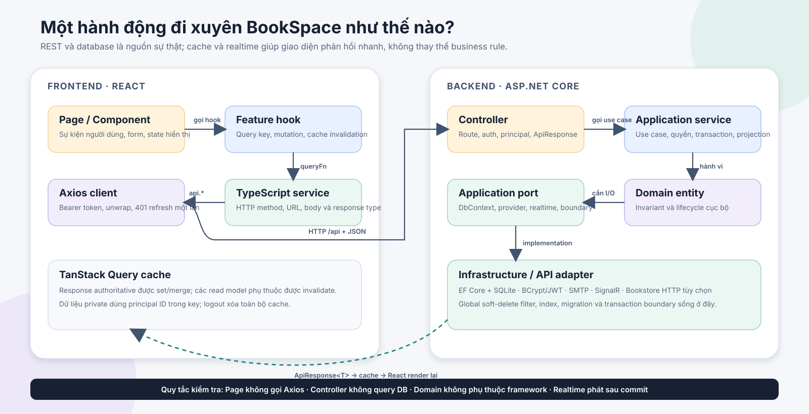
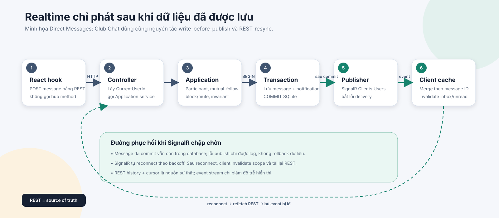

# BookSpace — Hướng dẫn đọc hiểu code và các luồng chạy

Tài liệu này dành cho người mới vào dự án hoặc người cần lần theo một hành vi từ
giao diện đến database. Mục tiêu không phải liệt kê lại toàn bộ endpoint, mà giải
thích **code nào gọi code nào, lớp nào chịu trách nhiệm gì, dữ liệu đổi ở đâu và
vì sao một thay đổi lại kéo theo các phần khác**.

Tài liệu bám theo source hiện tại trên nhánh phát hành `codex/product-readiness`.
Khi code và tài liệu mâu thuẫn, source và test của commit hiện tại là bằng chứng
cuối cùng; sau đó cần cập nhật lại tài liệu trong cùng thay đổi.

## 1. Hiểu dự án trong 5 phút

BookSpace là một sản phẩm mạng xã hội đọc sách độc lập, gồm hai process chính:

- `frontend`: React chạy trong browser.
- `backend`: ASP.NET Core cung cấp REST API, SignalR và truy cập database SQLite
  riêng của BookSpace.

Bookstore chỉ là nhà cung cấp metadata tùy chọn. Tắt Bookstore không làm mất auth,
catalog nội bộ, thư viện, phiên đọc, cộng đồng, câu lạc bộ, chat, thử thách hoặc
quản trị của BookSpace.

Một request thông thường đi theo đường này:

```text
React page
  -> feature hook / TanStack Query
  -> service TypeScript
  -> Axios client
  -> ASP.NET Controller
  -> Application service
  -> Domain entity + Application port
  -> EF Core / SQLite hoặc adapter bên ngoài
  -> ApiResponse<T>
  -> cache TanStack Query
  -> React render lại
```



Ba ý cần nhớ trước khi đọc sâu:

1. Backend dùng Clean Architecture, nhưng phần lớn use case truy vấn qua
   `IBookSpaceDbContext` — một port do Application sở hữu — chứ không tạo một
   repository riêng cho từng aggregate.
2. Frontend không gọi Axios trong page. Page gọi hook; hook quản lý cache/mutation;
   service TypeScript mới biết URL HTTP.
3. REST và database là nguồn sự thật. SignalR chỉ đẩy sự kiện sau khi mutation đã
   lưu; reconnect luôn quay lại refetch REST.

## 2. Nên đọc tài liệu nào trước

Mỗi file trong `docs` trả lời một câu hỏi khác nhau:

| Câu hỏi | Tài liệu |
|---|---|
| Sản phẩm phải làm gì? | [`PRODUCT_SPEC.md`](PRODUCT_SPEC.md) |
| Entity, trạng thái và invariant là gì? | [`DOMAIN_MODEL.md`](DOMAIN_MODEL.md) |
| Endpoint, body và response có dạng nào? | [`API_CONTRACT.md`](API_CONTRACT.md) |
| Các lớp và quyết định kỹ thuật là gì? | [`ARCHITECTURE.md`](ARCHITECTURE.md) |
| Code chạy qua các file nào? | Tài liệu đang đọc |
| Điều kiện nghiệm thu là gì? | [`ACCEPTANCE_TESTS.md`](ACCEPTANCE_TESTS.md) |
| Chạy production thế nào? | [`DEPLOYMENT.md`](DEPLOYMENT.md) |
| Bookstore được phép ảnh hưởng đến đâu? | [`INTEGRATION_WITH_BOOKSTORE.md`](INTEGRATION_WITH_BOOKSTORE.md) |

Thứ tự đọc phù hợp cho người mới:

1. Đọc phần 1–5 của tài liệu này để có bản đồ code.
2. Lần theo luồng catalog công khai ở phần 10.1.
3. Lần theo auth ở phần 10.2 để hiểu principal, token và route protection.
4. Lần theo Focus Reading ở phần 10.4 để thấy transaction và dữ liệu dẫn xuất.
5. Lần theo Direct Messages ở phần 10.6 để hiểu REST + SignalR.
6. Chọn bounded context đang làm và mở các tài liệu đặc tả tương ứng.

## 3. Chạy dự án để vừa đọc vừa quan sát

### 3.1 Chạy cả backend và frontend

Từ root repository:

```powershell
cd T:\bookspace
.\scripts\run-local.ps1
```

Script khởi động:

- backend tại `http://localhost:5080`;
- frontend tại `http://localhost:5173`.

Trong development, Vite proxy `/api` và `/hubs` sang port `5080`, được cấu hình ở
[`frontend/vite.config.ts`](../frontend/vite.config.ts). Vì vậy frontend dùng URL
tương đối `/api`, không cần hard-code origin backend.

### 3.2 Chạy riêng backend

```powershell
cd T:\bookspace\backend
dotnet run --project src\BookSpace.Api
```

Các điểm quan sát nhanh:

- `GET http://localhost:5080/health`: process và database có truy cập được không.
- `GET http://localhost:5080/openapi/v1.json`: OpenAPI, chỉ bật trong Development.
- `T:\bookspace\backend\data\bookspace.db`: database SQLite local mặc định.

Development tự chạy migration và seed nếu `SeedData:Enabled=true`. Hai tài khoản
seed mặc định:

```text
admin@bookspace.local  / Admin123!
reader@bookspace.local / Reader123!
```

### 3.3 Chạy riêng frontend

```powershell
cd T:\bookspace\frontend
npm ci
npm run dev
```

Nếu API không chạy ở `http://localhost:5080`, đặt
`VITE_DEV_API_PROXY_TARGET` trước khi chạy Vite.

### 3.4 Kiểm tra trước khi kết luận một thay đổi đã xong

```powershell
cd T:\bookspace
.\scripts\verify.ps1
```

Script này kiểm tra format/build/test backend, typecheck/lint/test/build frontend và
các quality gate liên quan. Smoke API đầy đủ hơn chạy bằng:

```powershell
.\scripts\smoke-api.ps1
```

## 4. Bản đồ repository

```text
bookspace/
├── backend/
│   ├── src/
│   │   ├── BookSpace.Domain/
│   │   ├── BookSpace.Application/
│   │   ├── BookSpace.Infrastructure/
│   │   └── BookSpace.Api/
│   └── tests/
│       ├── BookSpace.UnitTests/
│       └── BookSpace.IntegrationTests/
├── frontend/
│   └── src/
│       ├── pages/
│       ├── components/
│       ├── hooks/
│       ├── services/
│       ├── contexts/
│       ├── lib/
│       └── types/
├── docs/
├── scripts/
├── docker-compose.yml
└── docker-compose.production.yml
```

### 4.1 Hướng phụ thuộc backend

```text
BookSpace.Domain
      ^
      |
BookSpace.Application
      ^             ^
      |             |
BookSpace.Api   BookSpace.Infrastructure
```

Tham chiếu project thực tế:

- `BookSpace.Domain` không tham chiếu project nào khác.
- `BookSpace.Application` chỉ tham chiếu `BookSpace.Domain`.
- `BookSpace.Infrastructure` tham chiếu Application và Domain để triển khai port.
- `BookSpace.Api` là composition root, tham chiếu Application và Infrastructure.

Điều này có nghĩa Domain không được biết EF Core, HTTP, JWT, SMTP, SignalR hoặc
Bookstore. Application mô tả nhu cầu bằng interface; lớp ngoài cùng cung cấp
implementation.

### 4.2 Hướng phụ thuộc frontend

```text
pages + components
        ↓
feature hooks
        ↓
services
        ↓
lib/api.ts
        ↓
REST / SignalR
```

`types/domain.ts` mô tả response mà UI sử dụng; `types/api.ts` chứa envelope và
pagination dùng chung. Page được phép quản lý state trình bày như modal, form, tab;
cache dữ liệu server thuộc TanStack Query.

## 5. Luồng khởi động hệ thống

Hiểu startup trước giúp trả lời “implementation này được đăng ký ở đâu?” và “vì sao
middleware này chạy trước controller?”.

### 5.1 Backend khởi động từ `Program.cs`

Entry point là [`backend/src/BookSpace.Api/Program.cs`](../backend/src/BookSpace.Api/Program.cs).
Thứ tự chính:

1. Đọc `appsettings*.json`, sau đó nhận biến môi trường prefix `BOOKSPACE_`.
2. Cấu hình Data Protection; production có thể persist key ra volume.
3. Đăng ký controller và JSON camelCase/string enum.
4. Thay response model-binding mặc định bằng lỗi tiếng Việt trong `ApiResponse<T>`.
5. Đăng ký OpenAPI, health, rate limiting và trusted forwarding.
6. Gọi `AddBookSpaceInfrastructure(...)` để nối toàn bộ port với implementation.
7. Đăng ký SignalR và hai realtime publisher.
8. Cấu hình CORS theo allowlist.
9. Cấu hình JWT bearer và policy `AdminOnly`.
10. Lắp middleware theo thứ tự: forwarded headers → observability → exception →
    status code → CORS → rate limit → authentication → authorization.
11. Map `/health`, `/`, controllers và hai hub.
12. Chạy `DatabaseInitializer.InitializeAsync()` để apply migration, rồi seed trong
    Development nếu được bật.
13. `app.Run()` bắt đầu nhận request.

`OnTokenValidated` không chỉ kiểm chữ ký JWT. Mỗi request còn kiểm user vẫn tồn tại,
không bị khóa và claim `bookspace_auth_version` vẫn khớp `User.AuthVersion`. Vì vậy
reset mật khẩu hoặc khóa user có thể vô hiệu hóa access token đang còn hạn.

### 5.2 Dependency Injection nối port với adapter

Composition chính nằm ở
[`backend/src/BookSpace.Infrastructure/DependencyInjection.cs`](../backend/src/BookSpace.Infrastructure/DependencyInjection.cs).

Ví dụ:

```text
IBookSpaceDbContext       -> BookSpaceDbContext
IPasswordHasher           -> BCryptPasswordHasher
ITokenIssuer              -> JwtTokenIssuer
IExternalBookProvider     -> ExternalBookProvider
IAuthService              -> AuthService
ICatalogService           -> CatalogService
IReadingService           -> ReadingService
IDirectMessageService     -> DirectMessageService
```

`ChallengeMutationBoundary` hiện triển khai nhiều transaction port:

```text
IAuthMutationBoundary
IChallengeMutationBoundary
IReadingMutationBoundary
IClubChatMutationBoundary
IDirectMessageMutationBoundary
IOnboardingMutationBoundary
IExternalCatalogMutationBoundary
IBookListMutationBoundary
```

Tên class là dấu vết lịch sử; phạm vi hiện tại rộng hơn challenge. Application chỉ
phụ thuộc interface đúng với use case của nó nên không bị buộc biết class chung này.

### 5.3 Frontend khởi động từ `main.tsx`

[`frontend/src/main.tsx`](../frontend/src/main.tsx) bọc ứng dụng theo thứ tự:

```text
BrowserRouter
  QueryClientProvider
    ThemeProvider
      ToastProvider
        AuthProvider
          DirectMessageRealtimeProvider
            App
```

Ý nghĩa:

- Router có mặt trước mọi page.
- QueryClient dùng chung cho toàn app.
- Auth bootstrap chạy trước khi protected route quyết định redirect.
- Direct Message realtime chỉ kết nối khi đã có user hợp lệ.
- `App.tsx` lazy-load page và khai báo route public/protected/admin.

[`frontend/src/components/routing/ProtectedRoute.tsx`](../frontend/src/components/routing/ProtectedRoute.tsx)
chờ `AuthContext.isLoading=false`. Guest bị chuyển tới `/login` và giữ đường dẫn dự
định; `AdminRoute` kiểm role ở UI, nhưng backend vẫn là nơi phân quyền cuối cùng.

## 6. Một request backend đi qua những lớp nào

### 6.1 API layer: giao thức HTTP

Controller chịu trách nhiệm mỏng:

- route và HTTP verb;
- bind request/query/path;
- `[AllowAnonymous]`, `[Authorize]` hoặc policy/role;
- lấy principal từ JWT qua `CurrentUserId`/`OptionalUserId`;
- gọi Application service;
- trả `ApiResponse<T>` với status phù hợp.

Base class nằm ở
[`backend/src/BookSpace.Api/Controllers/ApiControllerBase.cs`](../backend/src/BookSpace.Api/Controllers/ApiControllerBase.cs).
Controller không tự query `BookSpaceDbContext`, không tự băm password và không chứa
quy tắc nghiệp vụ dài.

### 6.2 Application layer: use case và orchestration

Application service quyết định:

- principal có quyền tác động tài nguyên không;
- entity nào phải đọc/ghi;
- nhiều thay đổi có cần transaction chung không;
- lỗi use case nào phải trả với code/status nào;
- sau mutation cần đồng bộ goal, challenge hoặc notification nào;
- domain entity được map sang response contract ra sao.

Các interface service tập trung ở
[`ServiceInterfaces.cs`](../backend/src/BookSpace.Application/Services/ServiceInterfaces.cs)
và một số file riêng cho feature lớn. Contract HTTP/application nằm trong
`BookSpace.Application/Contracts`.

`ServiceMapper` tạo DTO từ entity và projection. Mapper có thể cần thêm query để lấy
author, category, rating, viewer state; Domain entity không tự biết DTO.

### 6.3 Domain layer: invariant cục bộ

Entity nằm trong `BookSpace.Domain/Entities`, enum trong `Domain/Enums`.

Domain bảo vệ những điều đúng với chính entity, ví dụ:

- `LibraryItem.UpdateProgress` không cho tiến độ đi lùi và tự chuyển trạng thái;
- `ActiveReadingSession.Pause/Resume` bảo vệ lifecycle phiên tập trung;
- `User.ChangePasswordHash` tăng `AuthVersion`;
- `DirectMessageReadState.Advance` chỉ tiến high-water mark;
- `Entity.SoftDelete` không cho xóa mềm hai lần.

`Guard` chuẩn hóa và kiểm tra dữ liệu cục bộ. Vi phạm ném `DomainException` có code
ổn định. Domain không biết HTTP status; middleware ở API mới map exception thành
response.

Quy tắc cần query nhiều aggregate, kiểm quyền principal hoặc tạo notification thuộc
Application, không nhét vào entity.

### 6.4 Application port: ranh giới nhìn ra ngoài

Port quan trọng nhất là
[`IBookSpaceDbContext`](../backend/src/BookSpace.Application/Abstractions/IBookSpaceDbContext.cs).
Nó cung cấp `IQueryable<T>` và thao tác add/remove/save nhưng không lộ `DbSet<T>` hay
API EF Core cho Application.

Các port chuyên biệt tồn tại khi use case cần semantics rõ hơn:

- transaction boundary cho concurrency-sensitive mutation;
- `IReadingGoalRepository`, `IReadingNoteRepository`,
  `IReadingInsightsRepository`;
- `IUserDiscoveryQuery`;
- `IExternalBookProvider`;
- `IClubChatRealtimePublisher`, `IDirectMessageRealtimePublisher`;
- các port đồng bộ challenge progress.

Khi lần code, đừng giả định lúc nào cũng có `XRepository`. Hãy mở constructor của
Application service để thấy đúng port mà use case đang dùng.

### 6.5 Infrastructure layer: EF Core và adapter

[`BookSpaceDbContext`](../backend/src/BookSpace.Infrastructure/Persistence/BookSpaceDbContext.cs)
triển khai `IBookSpaceDbContext` và sở hữu:

- mapping table/column;
- relationship và delete behavior;
- index/unique constraint;
- concurrency token;
- global query filter `DeletedAt`;
- quyền truy cập `IgnoreQueryFilters()` qua các property `IncludingDeleted` có chủ ý.

Migration nằm dưới `Infrastructure/Persistence/Migrations`. Startup gọi
`MigrateAsync`; không dùng `EnsureCreated` cho runtime chính.

`ChallengeMutationBoundary` mở SQLite `BEGIN IMMEDIATE`/serializable, retry ngắn khi
database busy và map một số unique/concurrency violation thành lỗi nghiệp vụ ổn
định. Nó ngăn các chuỗi read-check-write song song cùng vượt qua điều kiện trước khi
commit.

Adapter ngoài database gồm JWT, BCrypt, password recovery email và Bookstore HTTP.

### 6.6 Error và observability quay về client

[`ApiExceptionMiddleware`](../backend/src/BookSpace.Api/Common/ApiExceptionMiddleware.cs)
map lỗi thành envelope chung:

```json
{
  "success": false,
  "message": "Thông báo tiếng Việt",
  "data": null,
  "code": "ERROR_CODE",
  "timestamp": "..."
}
```

Mapping chính:

- `UseCaseException`: giữ status/code/message do Application chọn.
- `DomainException`: mặc định `400`; lỗi tiến độ đi lùi là `409`.
- `UnauthorizedAccessException`: `401`.
- `DbUpdateException`: `409 DATA_CONFLICT` nếu chưa được boundary map cụ thể.
- lỗi không dự kiến: `500 INTERNAL_ERROR`, không trả stack trace/SQL/secret.

`RequestObservabilityMiddleware` gắn `X-Correlation-ID` vào response và log method,
route template, status, elapsed time, correlation ID và user ID. Khi debug một request
lỗi, lấy header này trước rồi đối chiếu log backend.

## 7. Một request frontend đi qua những lớp nào

### 7.1 Page và component

Page ghép các feature hook và quản lý state hiển thị. Ví dụ `ExplorePage` gọi:

```text
useBooks
useBookRecommendations
useCategories
useAddToLibrary
useClubs
useChallenges
```

Page không biết base URL, token rotation hay Axios interceptor.

### 7.2 Hook và TanStack Query

Hook sở hữu:

- `queryKey` và principal scope;
- điều kiện `enabled`;
- `queryFn`/`mutationFn`;
- optimistic update nếu có;
- cache merge, rollback và invalidation sau mutation.

Ví dụ `useReading.ts` không chỉ gọi mutation. Khi ghi một phiên đọc, hook invalidate
library, dashboard, goals, insights, challenges, notifications, feed, catalog,
recommendations và danh sách session vì backend có thể cập nhật dữ liệu dẫn xuất.

Private data phải có principal ID trong key khi cache có nguy cơ sống qua thay đổi
account. Logout gọi `queryClient.clear()` để không giữ dữ liệu user cũ.

### 7.3 Service TypeScript

Service chỉ mô tả giao thức:

```text
HTTP method + URL + params/body + kiểu response
```

Ví dụ
[`catalog.service.ts`](../frontend/src/services/catalog.service.ts) biết
`GET /books`; [`useCatalog.ts`](../frontend/src/hooks/useCatalog.ts) biết query key;
`ExplorePage.tsx` biết cách trình bày.

### 7.4 Axios client và session

[`frontend/src/lib/api.ts`](../frontend/src/lib/api.ts) là client dùng chung:

- base URL mặc định `/api`;
- timeout 15 giây;
- gắn access token vào `Authorization`;
- unwrap `ApiEnvelope<T>`;
- nếu nhận `401`, chỉ retry request một lần sau refresh;
- dùng một `refreshPromise` chung để nhiều request `401` không đồng loạt rotate cùng
  refresh token;
- refresh thất bại thì xóa token và phát event `bookspace:session-expired`.

Implementation hiện tại lưu access token và refresh token trong localStorage dưới key
`bookspace.tokens`. `AuthContext` bootstrap bằng `GET /auth/me`, xử lý login/register,
logout và xóa toàn bộ query cache khi phiên kết thúc.

### 7.5 Response quay lại UI

Service gọi `unwrap` để lấy `data`. Query hook đưa dữ liệu vào cache. Component đang
subscribe key tương ứng render lại. Với mutation, response có thể được set trực tiếp
vào cache, nhưng mọi read model phụ thuộc vẫn phải invalidate/refetch.

## 8. Bản đồ bounded context sang file code

Các đường dẫn dưới đây là điểm vào, không phải toàn bộ file của feature.

| Khu vực | Frontend | API | Application | Domain / persistence | Test nên đọc |
|---|---|---|---|---|---|
| Auth/password recovery | `pages/auth`, `AuthContext`, `auth.service.ts`, `lib/api.ts` | `AuthController` | `AuthService` | `IdentityEntities`, `SecurityServices`, `PasswordRecoveryServices` | `PasswordRecoveryFlowTests`, `AuthRateLimitingTests`, `AuthPages.test.tsx` |
| User/profile/people | `PeoplePage`, `ProfilePage`, `usePeople` | `UsersController` | `UserService`, `UserDiscoveryQuery` | `User`, `Follow`, privacy fields | `PeopleDiscoveryFlowTests`, `PublicReaderProfileFlowTests` |
| Onboarding | `OnboardingPage`, `useOnboarding` | `UsersController` | `OnboardingService` | `UserPreferredCategory`, `UserReferenceBook` | `OnboardingDomainTests`, `OnboardingFlowTests` |
| Catalog/recommendation | catalog pages, `useCatalog`, `catalog.service.ts` | `CatalogController` | `CatalogService`, `ServiceMapper` | `Book`, `Author`, `Category`, join entities | `RecommendationServiceTests`, catalog flow tests |
| Catalog following | `CatalogFollowingPage`, `CatalogFollowButton` | `CatalogFollowingController` | `CatalogFollowingService`, `CatalogAlertDelivery` | catalog follow entities | `CatalogFollowingFlowTests`, `useCatalog.test.tsx` |
| Library/reading/focus | reading pages, `FocusReadingPanel`, `useReading` | `ReadingController` | `ReadingService`, `ChallengeProgressSynchronizer` | `LibraryItem`, `ReadingSession`, `ActiveReadingSession` | `DomainBehaviorTests`, `FocusReadingFlowTests`, `useReading.test.tsx` |
| Goals/notes/insights | `GoalsPage`, `NotesPage`, `InsightsPage` | ba controller tương ứng | service + repository riêng từng feature | `ReadingGoal`, `ReadingNote`, read-model queries | `ReadingGoalsAndNotesFlowTests`, `ReadingInsightsFlowTests` |
| Review/feed/community | `ReviewCard`, `FeedPage`, `useCommunity` | `CommunityController` | `CommunityService`, `UserSafetyPolicy` | review/comment/like entities | `FeedServiceTests`, `FeedPage.test.tsx` |
| Clubs | club pages/components, `useSocialProduct` | `ClubsController` | `ClubService` | club/member/invitation/post entities | `ClubManagementTests`, `BookClubManagementFlowTests` |
| Club chat | `ClubChatPanel`, `useClubChat` | `ClubChatController`, `ClubChatHub` | `ClubChatService`, realtime port | chat message/read state, SignalR publisher | `ClubChatFlowTests`, `useClubChat.test.tsx` |
| Reading sprint | `ReadingSprintPage`, `useReadingSprints` | `ClubReadingSprintsController` | `ClubReadingSprintService` | sprint/participant/check-in/milestone entities | sprint unit/integration tests |
| Direct Messages | `MessagesPage`, `useDirectMessages`, realtime context | `DirectMessagesController`, `DirectMessageHub` | `DirectMessageService`, realtime port | conversation/message/read state, publisher | `DirectMessageDomainTests`, `DirectMessageFlowTests` |
| Book lists | list pages/components, `useBookLists` | `BookListsController` | `BookListService` | `BookList`, `BookListItem` | book-list unit/integration/service tests |
| Challenges | challenge pages/hooks | `ChallengesController`, admin routes | `ChallengeService`, progress synchronizer | challenge/participation entities | challenge unit, flow, leaderboard và concurrency tests |
| Notifications/dashboard | account pages/hooks | `NotificationsController`, `DashboardController` | notification/dashboard services | `Notification`, projection queries | notification/admin dashboard flow tests |
| Safety/moderation | `UserSafetyActions`, report/admin pages | `UsersController`, `ContentReportsController`, `AdminController` | `UserSafetyService`, `ContentModerationService`, policy | block/mute/report entities | safety/moderation tests |
| External import | `ExternalBookImportPanel`, `admin.service.ts` | `AdminController` | `ExternalCatalogService`, provider port | `ExternalBookLink`, HTTP adapter | provider/import flow tests |

Tên file controller đầy đủ nằm trong `backend/src/BookSpace.Api/Controllers`; service
backend nằm trong `backend/src/BookSpace.Application/Services`.

## 9. Các pattern xuyên suốt dự án

### 9.1 Principal đi từ token, không đi từ body

Controller lấy `CurrentUserId` từ claim `sub`/NameIdentifier rồi truyền vào service.
Một body có `userId` do client tự gửi không được dùng để xác định owner. Các endpoint
public có thể truyền `OptionalUserId` để response biết viewer hiện tại, ví dụ trả
`currentShelf` của sách mà không biến endpoint catalog thành private.

### 9.2 Ownership được kiểm trong Application

Các hàm như `FindItem(userId, itemId)`, `FindOwned(listId, userId)` hoặc
`FindAccessibleConversation(userId, conversationId)` đưa ownership vào chính query.
Điều này vừa tránh lộ tài nguyên, vừa làm controller không phải lặp business rule.

Tài nguyên private/blocked thường được “cloak” bằng `404` thay vì xác nhận tài nguyên
tồn tại rồi trả `403`.

### 9.3 Soft delete và restore có chủ ý

Base `Entity` có `DeletedAt`. Global query filter ẩn row đã xóa khỏi query thông
thường. Một số quan hệ dùng unique index trên toàn lifecycle, nên re-add phải tìm qua
`IncludingDeleted` và restore row cũ thay vì insert row trùng, ví dụ:

- `LibraryItem` theo `(UserId, BookId)`;
- catalog author/category follow;
- `BookListItem` theo `(BookListId, BookId)`.

Không dùng `IgnoreQueryFilters()` tùy tiện. Chỉ infrastructure expose đúng tập query
`IncludingDeleted` mà use case restore/hard-replace cần.

### 9.4 Query page-number và cursor

Catalog/library/review thường dùng `PageResult<T>` với `page`, `pageSize`, `total`.
Chat và inbox dùng cursor dựa trên cặp thời gian + `Guid` để thứ tự ổn định khi hai row
cùng timestamp.

Khi thêm sort/paging, luôn có tie-breaker ID; nếu không, item có thể nhảy hoặc lặp
giữa hai trang.

### 9.5 Dữ liệu dẫn xuất được đồng bộ trong mutation

Một thao tác đọc sách có thể ảnh hưởng:

```text
LibraryItem
  -> ReadingGoal completion
  -> ChallengeParticipation high-water
  -> Notification completion
  -> dashboard/insight/feed read models ở lần query tiếp theo
```

Backend giữ các write quan trọng trong transaction; frontend invalidate các cache
consumer để lấy projection mới.

### 9.6 Notification tôn trọng preference và safety

`NotificationDelivery` kiểm preference theo loại thông báo và dùng
`UserSafetyPolicy` để không giao thông báo từ actor đã bị block/mute. Nhiều event có
deduplication key để retry hoặc concurrency không tạo thông báo lặp.

### 9.7 Realtime là delivery phụ, không phải transaction



Service lưu message và notification trước. Sau commit, publisher mới gửi SignalR.
Nếu SignalR lỗi, request không xóa message đã lưu; publisher log warning. Client merge
theo message ID để chống duplicate và refetch REST khi reconnect.

## 10. Các luồng end-to-end quan trọng

### 10.1 Luồng A — Mở trang khám phá và tải catalog công khai

Điểm bắt đầu dễ đọc nhất vì đây là query, chưa có transaction phức tạp.

Đường đi:

```text
frontend/src/pages/public/ExplorePage.tsx
  -> useBooks({ sort: "popular", page: 1, pageSize: 8 })
frontend/src/hooks/useCatalog.ts
  -> catalogService.books(query)
frontend/src/services/catalog.service.ts
  -> GET /api/books
frontend/src/lib/api.ts
  -> Axios request; gắn Bearer token nếu browser đang có session
backend/src/BookSpace.Api/Controllers/CatalogController.cs
  -> Books(..., OptionalUserId, ...)
backend/src/BookSpace.Application/Services/CatalogService.cs
  -> GetBooks(...)
backend/src/BookSpace.Application/Abstractions/IBookSpaceDbContext.cs
  -> Books, BookAuthors, Authors, BookCategories, Reviews, LibraryItems
backend/src/BookSpace.Infrastructure/Persistence/BookSpaceDbContext.cs
  -> EF Core query -> SQLite
backend/src/BookSpace.Application/Services/ServiceMapper.cs
  -> BookSummary, kể cả currentShelf nếu có viewer
ApiControllerBase.OkData
  -> ApiResponse<PageResult<BookSummary>>
useBooks query cache
  -> ExplorePage render BookCard
```

`CatalogService.GetBooks` thực hiện theo thứ tự:

1. Bắt đầu từ `db.Books`; global filter loại sách soft-delete.
2. Nếu có search, lọc title/ISBN và book ID của author khớp.
3. Nếu có author/category ID, lọc qua join entity.
4. Chuẩn hóa page/page size bằng `Paging.Normalize`.
5. Đếm total trước khi `Skip/Take`.
6. Chọn sort `popular`, `rating`, `title`, `newest` hoặc mặc định.
7. Luôn thêm `ThenBy(book.Id)` để phân trang ổn định.
8. Materialize rồi map sang DTO.

Điểm tinh tế: endpoint là `[AllowAnonymous]`, nhưng nếu access token có mặt và hợp lệ,
`OptionalUserId` vẫn giúp mapper trả shelf hiện tại của viewer. Guest nhận cùng catalog
nhưng `currentShelf=null`.

Khi debug catalog:

- URL sai: kiểm `catalog.service.ts` và Vite/Nginx proxy.
- filter sai: kiểm `CatalogService.GetBooks`.
- thiếu author/category/rating: kiểm `ServiceMapper.Book`.
- sách đã xóa vẫn hiện: kiểm global filter và query có dùng `IncludingDeleted` không.
- UI không cập nhật sau mutation: kiểm query key `catalogKeys` và invalidation.

### 10.2 Luồng B — Đăng nhập, gọi API được bảo vệ và tự refresh

Đăng nhập:

```text
LoginPage
  -> AuthContext.login(input)
  -> authService.login(input)
  -> POST /api/auth/login
  -> AuthController.Login
  -> AuthService.LoginAsync
  -> normalize email
  -> IBookSpaceDbContext.Users
  -> IPasswordHasher.Verify
  -> User.EnsureCanLogin
  -> ITokenIssuer.Issue
  -> lưu RefreshToken hash
  -> trả accessToken + refreshToken + user
  -> storeTokens(localStorage)
  -> AuthContext.setUser
```

Backend trả cùng `INVALID_CREDENTIALS` cho email không tồn tại và password sai để
không lộ tài khoản. Raw refresh token chỉ về client; database lưu hash. JWT chứa
`sub`, role, `jti`, thời gian và `bookspace_auth_version`.

Một request protected sau đó:

1. Axios request interceptor đọc token và gắn `Authorization: Bearer ...`.
2. JWT middleware kiểm issuer/audience/chữ ký/expiry.
3. `OnTokenValidated` kiểm user, lock và auth version trong database.
4. `[Authorize]` cho request đi vào controller.
5. `CurrentUserId` lấy principal; service không tin owner ID từ body.

Refresh khi access token hết hạn:

```text
request A -> 401 ┐
request B -> 401 ├-> một refreshPromise
request C -> 401 ┘      |
                  POST /api/auth/refresh
                        |
               AuthService.RefreshAsync
                        |
          hash raw token -> tìm active token
                        |
        tạo token pair mới + revoke token cũ
                        |
             lưu token mới trong localStorage
                        |
              retry mỗi request đúng một lần
```

Nếu refresh thất bại, `lib/api.ts` xóa token và dispatch
`bookspace:session-expired`; `AuthContext` xóa user và toàn bộ query cache.

Logout gửi refresh token để backend revoke, nhưng frontend dùng `finally` để luôn xóa
session local kể cả request logout gặp lỗi mạng.

Reset password còn mạnh hơn logout một token: trong một transaction, service consume
reset token, đổi password hash, tăng `AuthVersion` và revoke mọi refresh token của
user. Access token cũ bị từ chối ở lần validate tiếp theo vì auth version lệch.

### 10.3 Luồng C — Onboarding tạo đầu vào cho recommendation

Đường lưu preference:

```text
OnboardingPage
  -> useSaveOnboardingPreferences
  -> onboardingService.savePreferences
  -> PUT /api/users/me/onboarding
  -> UsersController.UpdateOnboardingPreferences
  -> OnboardingService.UpdatePreferencesAsync(CurrentUserId, request)
  -> IOnboardingMutationBoundary.ExecuteAsync
  -> validate category/book đang active
  -> hard-replace association cũ, kể cả row bị filter che
  -> SaveChanges
  -> trả OnboardingStateDto authoritative
  -> set cache ["onboarding", principalId]
  -> invalidate recommendation/library/people/dashboard/goals
```

Draft ở trạng thái `PENDING`/`SKIPPED` có thể có 0–5 phần tử mỗi tập. Khi complete,
service yêu cầu **3–5 category và 3–5 reference book đang active**. Preference của
state đã `COMPLETED` cũng phải tiếp tục giữ invariant này khi sửa.

Mutation dùng SQLite immediate transaction để hai request `skip`, `complete` hoặc
update song song không ghi đè terminal state vừa commit.

Đường đọc recommendation:

```text
ExplorePage
  -> useBookRecommendations
  -> GET /api/books/recommendations
  -> CatalogController.Recommendations(CurrentUserId)
  -> CatalogService.GetRecommendations
```

Service loại khỏi candidate các sách user đã có trong library, đã review hoặc đã chọn
làm reference. Các tín hiệu xếp hạng gồm:

1. author user theo dõi trực tiếp;
2. category user theo dõi trực tiếp;
3. review tốt từ độc giả user theo dõi và không bị ẩn;
4. author/category suy ra từ library, review tốt, reference book và preference;
5. average rating/review count làm fallback cộng đồng.

Mỗi item có `reasonCode`/`reasonText`; đây là read model deterministic từ dữ liệu hiện
tại, không phải ML model và không cần Bookstore.

### 10.4 Luồng D — Hoàn tất Focus Reading và cập nhật dữ liệu dẫn xuất

Frontend:

```text
FocusReadingPanel
  -> useFinishActiveReadingSession
  -> readingService.finishActiveSession
  -> POST /api/reading-sessions/active/finish
```

Backend:

```text
ReadingController.FinishActiveSession
  -> ReadingService.FinishActiveSessionAsync(CurrentUserId, request)
  -> ChallengeProgressSynchronizer.ExecuteMutationAndSyncAsync
     -> mutation boundary BEGIN IMMEDIATE
     -> tìm ActiveReadingSession của đúng user
     -> tính elapsed time bằng TimeProvider
     -> validate tối thiểu 1 phút và endingPage
     -> tạo ReadingSession.FromFocusReading
     -> LibraryItem.UpdateProgress
     -> xóa ActiveReadingSession
     -> SaveChanges
     -> ReadingGoalService.SynchronizeCompletionsAsync
     -> ChallengeProgressSynchronizer.SyncCoreAsync
        -> derive completed books trong cửa sổ challenge
        -> advance high-water, không giảm tiến độ
        -> thêm notification hoàn thành có dedup key
     -> commit
```

Tại sao phải đi qua synchronizer thay vì `SaveChanges` đơn lẻ? Vì “đã đọc xong một
cuốn” là nguồn cho goal và challenge. Nếu chỉ lưu session mà cập nhật challenge ở một
request sau, hệ thống có thể để lại trạng thái nửa vời khi process dừng giữa hai bước.

Sau success, hook:

- set active-session cache thành `null`;
- invalidate library, session history, dashboard, goals, insights, challenges,
  notifications, feed, catalog và recommendations.

Pause/resume đơn giản hơn: backend chỉ đổi state active session trong mutation
boundary; frontend set response trực tiếp vào active-session cache. Cancel xóa active
session nhưng không tạo lịch sử đọc và không tăng progress.

Khi debug một lỗi “đọc xong nhưng challenge chưa tăng”, lần theo cả ba điểm:

1. `LibraryItem` có chuyển `READ` và có `FinishedAt` trong cửa sổ challenge không.
2. Mutation có đi qua `ChallengeProgressSynchronizer` không.
3. Frontend có invalidate `challengeKeys.all` không.

### 10.5 Luồng E — Block/mute làm nội dung biến mất xuyên nhiều feature

Block/mute không chỉ là một bảng trong settings. Đây là policy cắt ngang profile,
feed, review, club, chat, notification, recommendation và direct message.

Điểm trung tâm là
[`UserSafetyPolicy`](../backend/src/BookSpace.Application/Services/UserSafetyPolicy.cs):

- `IsBlockedBetween`: block hai chiều về khả năng nhìn/tương tác;
- `IsMutedBy`: viewer ẩn actor một chiều;
- `HiddenUserIds`: hợp blocked + muted cho các query list;
- `EnsureCanView`: cloak profile bị block thành `USER_NOT_FOUND`;
- `EnsureCanInteract`: chặn mutation giữa hai user.

Ví dụ feed/recommendation lấy `HiddenUserIds` để loại nội dung; Direct Messages dùng
`IsBlockedBetween` để làm conversation không truy cập được; NotificationDelivery dùng
`IsHiddenFrom` trước khi thêm notification.

Frontend mutation block/mute phải invalidate nhiều namespace. Nếu API đã đúng nhưng
một card cũ vẫn hiện, kiểm danh sách invalidation trong hook safety/people, không vá
riêng component đang thấy lỗi.

### 10.6 Luồng F — Gửi Direct Message qua REST rồi nhận SignalR


Khi gửi:

```text
MessagesPage
  -> useDirectMessageThread.sendMessage
  -> directMessageService.sendMessage
  -> POST /api/conversations/{id}/messages
  -> DirectMessagesController.SendMessage
  -> DirectMessageService.SendMessageAsync
  -> IDirectMessageMutationBoundary.ExecuteAsync
     -> xác nhận user là participant
     -> cloak conversation nếu đã block
     -> yêu cầu hai user vẫn mutual-follow
     -> tạo DirectMessage
     -> cập nhật Conversation.LastActivityAt
     -> thêm Notification nếu recipient cho phép
     -> SaveChanges + commit
  -> IDirectMessageRealtimePublisher.PublishMessageCreatedAsync
  -> SignalR Clients.Users(sender, recipient).DirectMessageCreated
```

Điểm quan trọng: persistence hoàn tất trước publish. SignalR publisher bắt lỗi delivery
và log warning; nó không rollback message đã lưu.

Khi app đã đăng nhập, `DirectMessageRealtimeProvider` tạo một connection toàn app:

```text
/hubs/direct-messages
accessTokenFactory -> getRealtimeAccessToken()
event DirectMessageCreated
```

Khi nhận event, provider:

1. merge message theo ID vào cache thread;
2. invalidate inbox;
3. invalidate conversation detail;
4. invalidate unread count và notification scope.

Sender cũng nhận event, đồng thời REST response đã được hook merge vào cache. Hàm
`mergeDirectMessage` chống duplicate bằng ID. Khi reconnect, provider invalidate toàn
scope Direct Messages để REST bù event bị lỡ.

Lịch sử dùng cursor `(CreatedAt, Id)`; read state là high-water mark. `MarkReadAsync`
chỉ advance nếu message mới hơn, nên request cũ đến muộn không làm unread tăng ngược.

Club chat dùng pattern tương tự nhưng connection được quản lý theo panel/club thay vì
một connection inbox toàn app.

### 10.7 Luồng G — Admin import sách từ Bookstore nhưng BookSpace vẫn độc lập

```text
AdminBooksPage / ExternalBookImportPanel
  -> adminService.searchExternalBooks
  -> GET /api/external-books/search
  -> ExternalCatalogService.SearchAsync
  -> IExternalBookProvider
  -> ExternalBookProvider HTTP adapter
  -> Bookstore nếu Enabled=true
```

Khi config tắt, adapter trả `Available=false` với thông báo BookSpace vẫn hoạt động;
không làm hỏng catalog nội bộ.

Import:

```text
ExternalBookImportPanel
  -> POST /api/admin/books/import
  -> AdminController (AdminOnly)
  -> ExternalCatalogService.ImportAsync
  -> provider.GetByIdAsync
  -> IExternalCatalogMutationBoundary
  -> kiểm ExternalBookLink(provider, externalId)
  -> chuẩn hóa ISBN
  -> link sách có sẵn hoặc tạo Book/Author/Category
  -> tạo ExternalBookLink
  -> tạo catalog alerts
  -> SaveChanges
```

Idempotency có hai lớp:

- cùng `(provider, externalId)` trả `ALREADY_IMPORTED`;
- external ID mới nhưng ISBN trùng sẽ `LINKED_EXISTING`, không tạo Book thứ hai.

HTTP adapter giới hạn timeout, số item, response size và shape dữ liệu. Application
chỉ thấy `ExternalBookSearchResult`, không phụ thuộc JSON model của Bookstore.

### 10.8 Luồng H — Lỗi validation từ domain quay về form

Ví dụ user hoàn tất focus session với trang kết thúc không hợp lệ:

```text
FocusReadingPanel submit
  -> POST /reading-sessions/active/finish
  -> ReadingService kiểm use-case
  -> throw UseCaseException("INVALID_FOCUS_END_PAGE", ..., 400)
  -> ApiExceptionMiddleware
  -> ApiResponse failure
  -> Axios reject
  -> errorMessage(error)
  -> Toast/Form hiển thị tiếng Việt
```

Nếu body sai kiểu trước khi vào controller, `InvalidModelStateResponseFactory` trong
`Program.cs` trả `VALIDATION_ERROR` và field name camelCase. Vì vậy cần phân biệt:

- model binding/shape sai: dừng trước controller;
- use-case sai: service ném `UseCaseException`;
- invariant entity sai: Domain ném `DomainException`;
- unique/concurrency race: transaction boundary hoặc middleware map lỗi database.

## 11. Cách lần một feature bất kỳ

Giả sử cần hiểu nút “Theo dõi tác giả”. Làm theo checklist này:

1. Tìm text/nút ở page/component.
2. Xem callback gọi hook nào.
3. Trong hook, ghi lại mutation function, query key và invalidation.
4. Mở service TypeScript để lấy HTTP method + URL + body.
5. Tìm route trong controller.
6. Xem controller lấy `CurrentUserId`, `OptionalUserId` hay role nào.
7. Mở method Application service được gọi.
8. Liệt kê entity/port được đọc và ghi.
9. Nếu có transaction port, tìm implementation trong DI.
10. Mở domain method để thấy invariant cục bộ.
11. Mở DbContext để thấy unique index/query filter/relationship.
12. Mở integration test theo feature để xem hành vi happy path, forbidden, not found,
    duplicate và concurrency.
13. Trở lại frontend, kiểm mọi consumer cache đã được invalidate.

Mẫu ghi chú ngắn khi trace:

```text
UI action:
Hook:
Service URL:
Controller action:
Principal/role:
Application method:
Entities read:
Entities written:
Transaction boundary:
Domain invariant:
Notifications/realtime:
Response/cache invalidation:
Tests proving behavior:
```

## 12. Debug theo triệu chứng

### 12.1 `401` dù vừa đăng nhập

Kiểm theo thứ tự:

1. localStorage có `bookspace.tokens` không.
2. Request có `Authorization` không.
3. Access token có hết hạn không; `/auth/refresh` trả gì.
4. Refresh token có vừa bị rotate/revoke không.
5. User có bị lock/xóa hoặc `AuthVersion` thay đổi không.
6. API/SignalR có dùng đúng issuer, audience và secret không.
7. Với hub, query `access_token` chỉ được chấp nhận ở đúng hai hub path.

### 12.2 API trả đúng nhưng UI không đổi

Thường là cache, không phải controller:

1. mutation `onSuccess` có chạy không;
2. key invalidated có cùng shape với query consumer không;
3. private key có đúng principal ID không;
4. component có đang đọc một local copy cũ không;
5. realtime event có merge duplicate/đúng conversation ID không;
6. sau reconnect có refetch REST không.

### 12.3 Dữ liệu đã xóa vẫn xuất hiện hoặc không restore được

Kiểm:

1. entity có gọi `SoftDelete()` hay bị hard-delete;
2. `ApplySoftDeleteFilters` có áp cho entity;
3. query có vô tình dùng `IncludingDeleted`;
4. unique index áp trên active row hay toàn lifecycle;
5. use case re-add phải restore row hay được insert row mới.

### 12.4 Duplicate khi có hai request song song

Không chỉ thêm `Any()` check. Cần xem:

- database unique index;
- immediate transaction/read-check-write boundary;
- exception mapping ổn định;
- integration test concurrency.

`Any()` một mình vẫn race: hai request có thể cùng đọc “chưa tồn tại” trước khi một
request commit.

### 12.5 SignalR không hiện message

Phân tách hai câu hỏi:

1. REST POST có lưu message thành công không?
2. Event realtime có tới client không?

Nếu message đã có khi refresh trang, persistence đúng và lỗi nằm ở hub/auth/proxy/
connection/cache merge. Kiểm `/hubs/*` proxy WebSocket, access-token factory, trạng thái
connection, event name và reconnect invalidation. Không sửa database path khi bằng
chứng cho thấy chỉ delivery realtime lỗi.

### 12.6 Tính năng chỉ hỏng khi Bookstore tắt

Đây là vi phạm boundary. Core BookSpace không được phụ thuộc external provider. Kiểm
service có gọi provider trong đường catalog/library thường không, và code có xử lý
`Available=false` như trạng thái tùy chọn không.

### 12.7 Tìm request lỗi trong log

1. Lấy `X-Correlation-ID` từ response/network tab.
2. Tìm đúng ID trong backend log.
3. Xem route template, user ID, status và elapsed time.
4. Chỉ bật EF command logging trong môi trường debug phù hợp; không log token,
   password, connection string hoặc nội dung nhạy cảm.

## 13. Đọc test để hiểu contract thật

### 13.1 Unit test

`BookSpace.UnitTests` phù hợp để hiểu invariant và thuật toán không cần host/database:

- lifecycle entity;
- challenge progress derive/high-water;
- focus reading elapsed/pause/resume;
- onboarding state;
- recommendation scoring;
- safety entity;
- goal/note/insight calculation.

Nếu thay domain method, bắt đầu ở unit test tương ứng.

### 13.2 Integration test

`BookSpace.IntegrationTests` chạy API thật qua `WebApplicationFactory<Program>` và
SQLite file tạm riêng. `BookSpaceApiFactory`:

- chạy environment Development;
- dùng database path ngẫu nhiên trong temp;
- tăng limit auth mặc định cho test;
- cho phép override config/service;
- khởi động cùng DI, middleware, migration và controller thật.

Đây là nơi chứng minh:

- route/status/envelope;
- auth và ownership;
- persistence/index/query filter;
- transaction/concurrency;
- privacy/safety;
- provider failure;
- observability.

Khi sửa use case, tìm test `*FlowTests.cs` cùng tên trước khi viết test mới.

### 13.3 Frontend test

Frontend dùng Vitest + Testing Library. Ba tầng test phổ biến:

- service test: URL/method/body/response typing;
- hook test: query key, mutation, invalidation, realtime cache merge;
- page/component test: hành vi người dùng, state loading/error/empty/success và access.

Một feature end-to-end thường cần ít nhất Application/API integration test và test
hook/page cho cache/UX nếu frontend thay đổi.

## 14. Thêm một feature mới mà không phá kiến trúc

### 14.1 Nếu là use case mới trong bounded context hiện có

Thứ tự thực hiện khuyến nghị:

1. Cập nhật product/API/domain contract nếu behavior mới.
2. Thêm/sửa domain entity method nếu có invariant cục bộ.
3. Thêm contract và method interface ở Application.
4. Implement Application service, ownership và transaction boundary.
5. Mở rộng `IBookSpaceDbContext` hoặc port chuyên biệt nếu thật sự cần.
6. Cấu hình EF/index/migration ở Infrastructure.
7. Thêm controller action mỏng.
8. Thêm type/service/hook/page frontend.
9. Xác định toàn bộ query cache consumer phải invalidate.
10. Viết unit/integration/frontend test.
11. Chạy verify và smoke liên quan.
12. Cập nhật tài liệu trong cùng commit.

### 14.2 Khi nào tạo repository/port riêng

Không cần tạo repository chỉ để “đủ pattern”. Tạo port riêng khi cần một trong các lý
do rõ ràng:

- query semantics phức tạp cần ẩn implementation;
- transaction/concurrency behavior chuyên biệt;
- adapter có thể thay thế (SMTP, external HTTP, realtime);
- Application không nên biết chi tiết provider;
- test cần fake một boundary ổn định.

Nếu use case chỉ cần query entity và save trong abstraction hiện có,
`IBookSpaceDbContext` là pattern đang được dự án dùng.

### 14.3 Checklist review kiến trúc

- Domain có import EF/ASP.NET/HTTP/vendor không?
- Controller có business rule hoặc query database trực tiếp không?
- Principal có lấy từ token thay vì body không?
- Ownership và privacy có được kiểm trước khi map response không?
- Mutation nhiều bước có transaction phù hợp không?
- Unique constraint có bảo vệ race ở database không?
- Soft-delete/restore có đúng lifecycle không?
- Notification có tôn trọng preference và safety không?
- Realtime có publish sau persistence và reconnect qua REST không?
- Frontend page có gọi Axios trực tiếp không?
- Private query key có principal scope không?
- Mutation có invalidate mọi read model phụ thuộc không?
- Lỗi user-facing có tiếng Việt và code ổn định không?
- Core feature có còn chạy khi Bookstore tắt không?

## 15. Lộ trình đọc code đề xuất trong 1 ngày

### Chặng 1 — 45 phút: bootstrap và query đơn giản

Đọc theo thứ tự:

1. `frontend/src/main.tsx`
2. `frontend/src/App.tsx`
3. `frontend/src/pages/public/ExplorePage.tsx`
4. `frontend/src/hooks/useCatalog.ts`
5. `frontend/src/services/catalog.service.ts`
6. `frontend/src/lib/api.ts`
7. `backend/src/BookSpace.Api/Controllers/CatalogController.cs`
8. `backend/src/BookSpace.Application/Services/CatalogService.cs` — chỉ `GetBooks`
9. `backend/src/BookSpace.Application/Services/ServiceMapper.cs` — chỉ `Book`
10. `backend/src/BookSpace.Infrastructure/Persistence/BookSpaceDbContext.cs` — catalog
    mapping và soft-delete filter.

Kết quả cần đạt: giải thích được một `BookCard` lấy dữ liệu từ đâu.

### Chặng 2 — 60 phút: auth và request pipeline

Đọc:

1. `AuthContext.tsx`
2. `auth.service.ts`
3. `lib/api.ts` — interceptors
4. `ProtectedRoute.tsx`
5. `Program.cs` — JWT/middleware
6. `AuthController.cs`
7. `AuthService.cs`
8. `IdentityEntities.cs`
9. `SecurityServices.cs`
10. `PasswordRecoveryFlowTests.cs`.

Kết quả cần đạt: giải thích login, refresh rotation, logout và reset invalidation.

### Chặng 3 — 90 phút: mutation + transaction + read model

Đọc:

1. `FocusReadingPanel.tsx`
2. `useReading.ts`
3. `reading.service.ts`
4. `ReadingController.cs`
5. `ReadingService.cs` — start/pause/resume/finish
6. `ReadingEntities.cs`
7. `ChallengeProgressSynchronizer.cs`
8. `ChallengeMutationBoundary.cs`
9. `FocusReadingFlowTests.cs`
10. `ChallengeProgressConcurrencyTests.cs`.

Kết quả cần đạt: giải thích vì sao finish một phiên làm nhiều màn hình đổi.

### Chặng 4 — 60 phút: privacy và realtime

Đọc:

1. `UserSafetyPolicy.cs`
2. `DirectMessageService.cs`
3. `SignalRDirectMessageRealtimePublisher.cs`
4. `DirectMessageHub.cs`
5. `direct-message.connection.ts`
6. `DirectMessageRealtimeContext.tsx`
7. `useDirectMessages.ts`
8. `DirectMessageFlowTests.cs`
9. `UserSafetyFlowTests.cs`.

Kết quả cần đạt: phân biệt rõ persistence, authorization, event delivery và cache.

### Chặng 5 — 45 phút: extension boundary và release

Đọc:

1. `ExternalCatalogService.cs`
2. `ExternalBookProvider.cs`
3. `ExternalCatalogImportFlowTests.cs`
4. `INTEGRATION_WITH_BOOKSTORE.md`
5. `scripts/verify.ps1`
6. `scripts/smoke-api.ps1`
7. `DEPLOYMENT.md`.

Kết quả cần đạt: giải thích được phần nào là core và phần nào là optional adapter.

## 16. Thuật ngữ dùng trong code

| Thuật ngữ | Nghĩa trong BookSpace |
|---|---|
| Principal | User hiện tại đã được xác thực từ JWT |
| Owner | Principal sở hữu tài nguyên và được phép mutation |
| Port | Interface ở Application mô tả nhu cầu với database/provider/realtime |
| Adapter | Implementation ở Infrastructure/API cho một port |
| Application service | Lớp điều phối một nhóm use case |
| Domain invariant | Điều luôn phải đúng bên trong entity/lifecycle |
| Read model/projection | DTO được tính từ nhiều entity để phục vụ màn hình/query |
| Soft delete | Đặt `DeletedAt`, giữ row cho audit/restore/moderation |
| High-water mark | Giá trị chỉ tiến tới, không lùi; dùng cho progress/read state |
| Principal-scoped cache | Query key chứa user ID để dữ liệu private không lẫn account |
| Mutation boundary | Port bao một chuỗi read-check-write trong transaction |
| Cloaking | Trả not-found để không tiết lộ tài nguyên private/blocked tồn tại |
| Realtime publisher | Adapter phát SignalR sau khi dữ liệu đã lưu |

## 17. Tóm tắt để tự kiểm tra mức hiểu

Sau khi đọc tài liệu và source theo lộ trình trên, bạn nên tự trả lời được:

1. `Program.cs` đăng ký service nào và middleware chạy theo thứ tự nào?
2. Vì sao Application thấy dữ liệu nhưng không phụ thuộc EF Core?
3. Invariant nào thuộc Domain, rule nào thuộc Application?
4. `CurrentUserId` đến từ đâu và vì sao không lấy owner từ body?
5. Vì sao soft-delete đôi khi phải restore row cũ?
6. Vì sao `Any()` check vẫn cần unique index/transaction?
7. Vì sao finish reading session ảnh hưởng challenge và notification?
8. Vì sao SignalR lỗi không được rollback message đã lưu?
9. Vì sao private TanStack Query key cần principal ID?
10. Vì sao BookSpace vẫn chạy đầy đủ khi Bookstore tắt?

Nếu chưa trả lời được câu nào, dùng đúng câu đó làm từ khóa để quay lại phần tương
ứng, rồi mở file source và test được liên kết. Đó là cách nhanh nhất để chuyển từ
“biết cấu trúc thư mục” sang “hiểu hệ thống chạy như thế nào”.
