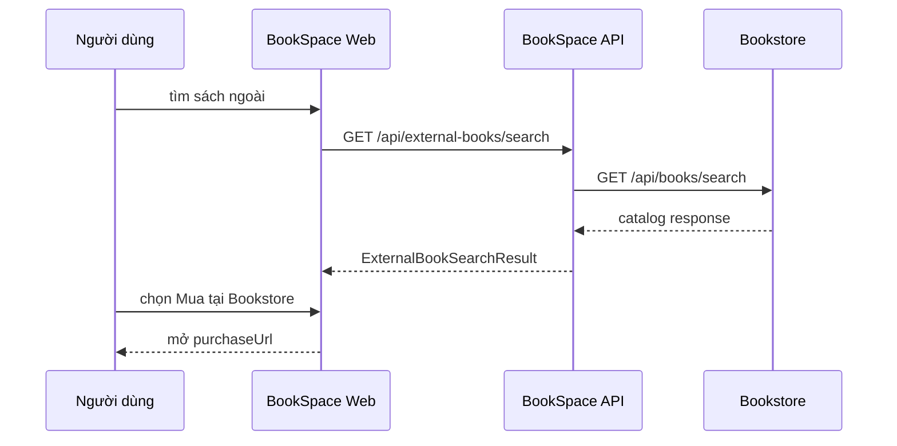

# BookSpace — Tích hợp tùy chọn với Bookstore

> BookSpace là sản phẩm độc lập. Tài liệu này định nghĩa anti-corruption boundary để hai sản phẩm có thể ghép thành hệ sinh thái lớn mà không biến BookSpace thành module phụ.

## 1. Quy tắc ranh giới

1. BookSpace và Bookstore không dùng chung database, schema, database user hoặc migration.
2. BookSpace không đọc trực tiếp bảng `books`, `users`, `orders` của Bookstore.
3. Hai sản phẩm không chia sẻ password hash, refresh token, session cookie, JWT signing secret hoặc private key.
4. UUID Bookstore luôn là external ID kèm `provider`; không dùng làm BookSpace entity ID.
5. Tắt integration không làm hỏng startup, health, auth, catalog nội bộ, library, review, club, challenge, notification hoặc dashboard.
6. Dữ liệu ngoài phải qua provider adapter và mapping trước khi ra API BookSpace.
7. Webhook dùng secret tích hợp riêng; secret đó không phải identity/JWT secret.
8. Không ghi secret vào source, database seed, response hoặc log.

## 2. Data ownership

| Dữ liệu | Chủ sở hữu | Hệ thống còn lại được làm gì |
|---|---|---|
| BookSpace account/profile | BookSpace | không truy cập nếu chưa có consent/link |
| BookSpace library/session/review | BookSpace | không ghi trực tiếp |
| BookSpace club/challenge | BookSpace | không ghi trực tiếp |
| Bookstore account | Bookstore | BookSpace chỉ giữ external user ID sau link |
| Bookstore catalog/giá/tồn kho | Bookstore | BookSpace đọc qua public/integration API |
| Bookstore cart/order/payment | Bookstore | BookSpace chỉ nhận sự kiện tối thiểu đã ký |
| External mapping/idempotency receipt | BookSpace | Bookstore không truy cập DB |

## 3. Mức tích hợp

### Mức 0 — độc lập hoàn toàn, bắt buộc Goal 1

```text
BOOKSPACE_BookstoreIntegration__Enabled=false
```

- BookSpace dùng catalog seed/nội bộ.
- Không có outbound HTTP tới Bookstore.
- `/health` xanh khi database BookSpace hoạt động.
- `/api/external-books/search` trả `200` với `available=false`, `items=[]` và message giải thích provider đang tắt.

### Mức 1 — tìm kiếm và đường dẫn mua, optional Goal 1

BookSpace gọi public Bookstore REST API để:

- tìm sách;
- hiển thị metadata ngoài;
- hiển thị giá/khả dụng nếu response có;
- mở `purchaseUrl` ở Bookstore.

Không đồng bộ database và không cần link tài khoản.

### Mức 2 — liên kết tài khoản và nhập sách đã mua, sau Goal 1

- Người dùng chủ động link BookSpace với Bookstore.
- Bookstore gửi webhook khi đơn đủ điều kiện.
- BookSpace ghi idempotency receipt và đề xuất/thêm sách vào library.
- Người dùng có thể hủy link.

Mức 2 yêu cầu thay đổi ở cả hai sản phẩm; Bookstore hiện chưa có outbound purchase webhook cho BookSpace.

### Mức 3 — SSO qua OpenID Connect, sau Goal 1

Cả hai sản phẩm tin một identity provider độc lập qua issuer/public keys. Không cho BookSpace xác thực JWT Bookstore bằng secret chia sẻ.

## 4. Provider abstraction

Application contract:

```csharp
public sealed record ExternalBookResult(
    string ExternalId,
    string Title,
    IReadOnlyList<string> Authors,
    string? CoverImageUrl,
    string? Isbn,
    decimal? Price,
    string? PurchaseUrl);

public sealed record ExternalBookSearchResult(
    bool Available,
    string Provider,
    string Message,
    IReadOnlyList<ExternalBookResult> Items);

public interface IExternalBookProvider
{
    Task<ExternalBookSearchResult> SearchAsync(
        string query,
        int limit,
        CancellationToken cancellationToken);
}
```

Goal 1 dùng `ExternalBookProvider` ở Infrastructure. Khi config tắt, adapter
short-circuit trước khi có outbound HTTP; khi bật, adapter gọi REST Bookstore và
map qua anti-corruption DTO. Provider khác trong tương lai phải có adapter
riêng, không thêm nhánh vào Domain.

## 5. Outbound REST tới Bookstore

Bookstore hiện có contract công khai:

```http
GET {baseUrl}/books/search?keyword={query}&page=0&size={limit}
GET {baseUrl}/books/{bookId}
```

Điểm khác biệt cần adapter xử lý:

- Bookstore bọc danh sách trong `ApiResponse<List<BookResponse>>`.
- Pagination Bookstore hiện nằm ở header `X-Total-Count`, `X-Page`, `X-Size`, `X-Has-Next`.
- BookSpace dùng `PageResult<T>` trong body.
- Bookstore dùng `keyword`, `page`, `size`; BookSpace public API dùng `query`, `limit`.
- Tên field ảnh/giá có thể khác BookSpace.

`ExternalBookProvider` không chuyển nguyên response Bookstore ra client. Mapping tối thiểu:

| Bookstore | BookSpace external |
|---|---|
| `id` | `externalId` |
| `title` | `title` |
| author name/list | `authors[]` |
| ISBN | `isbn` |
| effective/discount/base price phù hợp | `price` |
| cover/image URL | `coverImageUrl` |
| route frontend được cấu hình + ID | `purchaseUrl` |

Nếu một field ngoài không có, dùng `null`; không tự bịa giá, tồn kho hoặc URL.

## 6. Cấu hình provider

| Key | Bắt buộc | Nội dung |
|---|---:|---|
| `BOOKSPACE_BookstoreIntegration__Enabled` | không | `false` mặc định |
| `BOOKSPACE_BookstoreIntegration__BaseUrl` | khi bật | base URL Bookstore gồm `/api` |
| `BOOKSPACE_BookstoreIntegration__StorefrontUrl` | khi bật link mua | URL website Bookstore |
| `BOOKSPACE_BookstoreIntegration__TimeoutSeconds` | không | mặc định 5, giới hạn 1..30 |

Không commit giá trị thật. `ApiKey` và `WebhookSecret` phải là hai secret khác nhau.

## 7. Resilience

`ExternalBookProvider`:

- timeout tối đa theo config;
- truyền cancellation token;
- Goal 1 không retry tự động; client có thể yêu cầu lại theo ý người dùng;
- không cache trạng thái unavailable như kết quả thành công;
- map envelope/list phổ biến và bỏ item thiếu `id` hoặc `title`;
- giới hạn số item bằng `limit`;
- không log API key, webhook secret hoặc full payload chứa dữ liệu cá nhân.

Kết quả lỗi:

| Trường hợp | BookSpace response |
|---|---|
| integration tắt | 200, `available=false`, `items=[]` |
| timeout/upstream 5xx | 200, `available=false`, `items=[]` |
| JSON/envelope không nhận diện được | 200, `available=true`, `items=[]` |
| query rỗng | 200, `provider=none`, `available=false`, `items=[]` |
| không có kết quả hợp lệ | 200 với `items: []` |

Lỗi provider không làm circuit của core API thất bại; `/health` không gọi provider.

## 8. Purchase link

`purchaseUrl` được tạo từ allowlisted `Bookstore Web URL` và external book ID đã encode. Không nhận URL tùy ý từ query của người dùng.

Luồng:



BookSpace không tạo cart/order thay người dùng trong Mức 1.

## 9. Account linking cho Mức 2

Không map tài khoản bằng email tự động. Người dùng phải chứng minh quyền sở hữu cả hai tài khoản bằng authorization code một lần.

Entity BookSpace bổ sung khi triển khai:

### `ExternalAccountLink`

| Field | Kiểu | Quy tắc |
|---|---|---|
| `Id` | UUID | BookSpace tạo |
| `BookSpaceUserId` | UUID | owner |
| `Provider` | string | `bookstore` |
| `ExternalUserId` | string | ID do Bookstore trả |
| `CreatedAt` | datetime | UTC |
| `RevokedAt` | datetime hoặc null | hủy link |

Unique active `(BookSpaceUserId, Provider)` và `(Provider, ExternalUserId)`.

Không lưu Bookstore password, access token dài hạn hoặc refresh token nếu chỉ cần webhook mapping.

## 10. Purchase completed webhook cho Mức 2

Endpoint đề xuất phía BookSpace:

```http
POST /api/integrations/bookstore/webhooks/purchase-completed
X-Bookstore-Event-Id: 01JAZR3NDEKTSV4RRFFQ69G5FAV
X-Bookstore-Timestamp: 2026-07-29T10:00:00Z
X-Bookstore-Signature: sha256=<hex>
Content-Type: application/json
```

Payload tối thiểu:

```json
{
  "schemaVersion": 1,
  "eventType": "PURCHASE_COMPLETED",
  "occurredAt": "2026-07-29T10:00:00Z",
  "orderId": "aaaaaaaa-aaaa-aaaa-aaaa-aaaaaaaaaaaa",
  "externalUserId": "bbbbbbbb-bbbb-bbbb-bbbb-bbbbbbbbbbbb",
  "items": [
    {
      "externalBookId": "cccccccc-cccc-cccc-cccc-cccccccccccc",
      "isbn": "9780132350884",
      "title": "Clean Code",
      "quantity": 1
    }
  ]
}
```

Không gửi địa chỉ, số điện thoại, payment token, giá chi tiết hoặc thông tin không cần cho library import.

Xác minh:

1. Timestamp lệch tối đa 5 phút.
2. HMAC SHA-256 trên bytes chính xác của body kết hợp event ID và timestamp theo format đã version.
3. Constant-time comparison.
4. External user phải có link đang hoạt động.
5. Event ID chưa được xử lý.
6. Schema version và event type được hỗ trợ.

### `IntegrationEventReceipt`

| Field | Kiểu | Quy tắc |
|---|---|---|
| `Id` | UUID | BookSpace tạo |
| `Provider` | string | `bookstore` |
| `ExternalEventId` | string | unique theo provider |
| `EventType` | string | `PURCHASE_COMPLETED` |
| `PayloadHash` | string | SHA-256, không lưu secret |
| `Status` | enum | `PROCESSED`, `IGNORED`, `FAILED` |
| `ProcessedAt` | datetime | UTC |
| `FailureCode` | string hoặc null | code đã sanitize |

Webhook lặp cùng event ID và cùng payload trả 200, không tạo library item thứ hai. Cùng event ID nhưng payload hash khác trả 409.

## 11. Đối sánh sách khi nhập purchase

Thứ tự:

1. Mapping external đã được xác nhận nếu sau này có entity mapping.
2. ISBN chuẩn hóa trùng chính xác một BookSpace `Book`.
3. Không match nếu ISBN trống hoặc có nhiều candidate.

Nếu không match:

- không tự tạo catalog BookSpace;
- ghi receipt `IGNORED` với code `BOOK_MAPPING_NOT_FOUND`;
- tạo notification cho người dùng chỉ khi sản phẩm có UX xử lý mapping.

Nếu match:

- nếu sách chưa trong library: thêm `WANT_TO_READ`;
- nếu đã tồn tại: giữ shelf/progress hiện tại;
- không đổi `READ` thành `WANT_TO_READ`;
- quantity lớn hơn 1 vẫn chỉ tạo một library entry.

## 12. SSO tương lai

Hướng hợp lệ:

```text
BookSpace Web ─┐
Bookstore Web ─┼── OpenID Connect Provider
BookSpace API ─┤
Bookstore API ─┘
```

Yêu cầu:

- issuer chung được cấu hình;
- mỗi API có audience riêng;
- xác minh bằng public key/JWKS;
- BookSpace vẫn giữ local user ID và mapping `subject`;
- logout/revoke theo chuẩn provider;
- migration/link tài khoản có consent.

Hướng bị cấm:

- copy `JWT_SECRET` từ Bookstore sang BookSpace;
- BookSpace đọc bảng user Bookstore;
- chấp nhận token chỉ vì có claim `role`;
- map account tự động chỉ dựa trên email chưa được xác minh.

## 13. Acceptance integration

### Mức 0

- Bookstore tắt hoàn toàn nhưng BookSpace build/start/health và mọi core flow vẫn đạt.
- Không outbound request xuất hiện trong log khi integration disabled.

### Mức 1

- Adapter gọi đúng `/api/books/search` với `keyword/page/size`.
- Adapter map đúng ID, title, authors, ISBN, cover, price và purchase URL.
- Upstream header pagination không rò rỉ thành contract BookSpace.
- Timeout/payload sai trả error code đã định nghĩa.
- Link mua trỏ domain allowlist.

### Mức 2

- Link account cần consent và proof.
- Webhook signature/timestamp/event ID được xác minh.
- Replay không nhân đôi library item.
- User chưa link không bị nhập purchase.
- Payload không chứa dữ liệu thanh toán/địa chỉ.
- Hủy link ngăn event mới nhưng không xóa dữ liệu BookSpace cũ.
